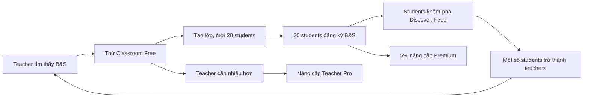

# Classroom — Mô hình Kinh doanh

## 1. Tổng quan doanh thu

Classroom tạo ra **3 nguồn doanh thu mới**, tách biệt với Premium subscription hiện tại ($4.99/tháng):

```
┌─────────────────────────────────────────────────────────┐
│                  Backing & Score Revenue                 │
├─────────────────┬───────────────────┬───────────────────┤
│ B2C (hiện tại)  │ B2B2C (mới)      │ B2B (tương lai)   │
│                 │                   │                   │
│ Student Premium │ Teacher Pro       │ Institution       │
│ $4.99/tháng     │ $9.99/tháng       │ $99+/tháng        │
│                 │                   │                   │
│ Unlimited Wait  │ Classroom tools   │ Multi-teacher     │
│ PDF/MusicXML    │ Live Lesson       │ Custom branding   │
│ Academy         │ Classroom Library │ Analytics         │
│ Ad-free         │ Progress tracking │ SSO / LMS         │
└─────────────────┴───────────────────┴───────────────────┘
```

---

## 2. Bảng giá chi tiết

### 2.1 Teacher Plans

| | **Teacher Free** | **Teacher Pro** | **Teacher Team** |
|---|---|---|---|
| **Giá** | $0 | **$9.99/tháng** hoặc $79.99/năm | **$29.99/tháng** |
| **Số lớp** | 1 | Không giới hạn | Không giới hạn |
| **Students/lớp** | 10 | 50 | 100 |
| **Classroom Library** | 20 exercises | Không giới hạn | Không giới hạn |
| **Assignment types** | Practice only | Practice + Assessment | Tất cả |
| **Live Lesson** | ❌ | ✅ 60 phút/session | ✅ 120 phút/session |
| **Recording** | ❌ | ❌ | ✅ |
| **Progress Dashboard** | Cơ bản | Đầy đủ + export CSV | Đầy đủ + API |
| **Support** | Community | Email | Priority |

### 2.2 Institution License (B2B)

| | **School** | **Conservatory** |
|---|---|---|
| **Giá** | $99/tháng | Liên hệ |
| **Teachers** | 5 | Không giới hạn |
| **Students** | 200 | Không giới hạn |
| **Admin Dashboard** | ✅ | ✅ |
| **Custom Branding** | ❌ | ✅ Logo + domain |
| **SSO** | ❌ | ✅ |
| **LMS Integration** | ❌ | ✅ (Google Classroom, Canvas) |
| **Onboarding** | Self-serve | Dedicated support |

### 2.3 Student — vẫn miễn phí trong Classroom

> **Nguyên tắc quan trọng:** Students KHÔNG trả thêm tiền để vào Classroom. Nếu bắt students trả tiền → teachers sẽ dùng Zoom + PDF thay vì B&S.

| Student trong Classroom | Miễn phí |
|---|---|
| Tham gia lớp, xem bài tập | ✅ |
| Practice bài được giao | ✅ |
| Nộp bài, xem phản hồi | ✅ |
| Tham gia Live Lesson | ✅ |
| Wait Mode (3 lượt/ngày) | ✅ |
| **Muốn Wait Mode unlimited?** | → Nâng cấp Student Premium $4.99/tháng |
| **Muốn export PDF?** | → Nâng cấp Student Premium $4.99/tháng |

**Upsell tự nhiên:** Student practice bài teacher giao → Wait Mode hết 3 lượt → "Nâng cấp Premium để luyện tập không giới hạn" → conversion.

---

## 3. Phân tích doanh thu

### 3.1 Kịch bản bảo thủ (Year 1)

| Metric | Tháng 6 | Tháng 12 |
|--------|---------|----------|
| Teachers Free | 50 | 200 |
| Teachers Pro ($9.99) | 5 | 30 |
| Students miễn phí (via Classroom) | 150 | 1,500 |
| Students → Premium upsell (5%) | 8 | 75 |
| **MRR từ Teacher Pro** | $50 | **$300** |
| **MRR từ Student upsell** | $40 | **$375** |
| **Tổng MRR mới từ Classroom** | **$90** | **$675** |

### 3.2 Kịch bản lạc quan (Year 1)

| Metric | Tháng 6 | Tháng 12 |
|--------|---------|----------|
| Teachers Free | 100 | 500 |
| Teachers Pro | 15 | 100 |
| Students miễn phí | 500 | 5,000 |
| Students → Premium (8%) | 40 | 400 |
| Institution ($99) | 0 | 3 |
| **Tổng MRR** | **$350** | **$3,297** |

### 3.3 Unit Economics

| Metric | Giá trị |
|--------|---------|
| **CAC Teacher** (customer acquisition) | ~$0 (viral: teacher tìm tool → thử free → upgrade) |
| **CAC Student** | ~$0 (teacher mời vào lớp → organic) |
| **LTV Teacher Pro** ($9.99 × 12 tháng avg) | ~$120 |
| **LTV Student Premium** ($4.99 × 8 tháng avg) | ~$40 |
| **Students per Teacher** (avg) | ~15 |
| **Conversion Teacher Free → Pro** | ~15% (target) |
| **Conversion Student Free → Premium** | ~5-8% |

### 3.4 Chi phí vận hành Classroom

| Hạng mục | Chi phí/tháng | Ghi chú |
|----------|--------------|---------|
| **LiveKit Cloud** | ~$0 - $50 | Free tier 50K minutes, sau đó $0.004/min |
| **Appwrite Cloud** | Đã có | Classroom collections dùng chung |
| **Băng thông** | Minimal | Sheet music = text, không stream media |
| **Storage** | Minimal | MusicXML files rất nhỏ (~50KB/file) |
| **Tổng chi phí biên** | **< $50/tháng** | Margin > 90% |

---

## 4. Chiến lược tăng trưởng

### 4.1 Viral Loop — Teacher → Students



**Hệ số viral:** Mỗi teacher mang về ~20 users. Nếu 5% users đó trở thành teachers → 1 teacher ban đầu → 1 teacher mới → vòng lặp.

### 4.2 SEO & Content Marketing

| Kênh | Nội dung | Mục tiêu |
|------|----------|----------|
| Blog | "Dạy nhạc online hiệu quả với sheet nhạc tương tác" | Teacher tìm kiếm tool |
| YouTube | Demo Live Lesson (synced sheet music) | Viral video |
| Facebook Groups | Target nhóm giáo viên nhạc VN, piano teachers | Reach teachers trực tiếp |
| Music Forums | Reddit r/musicteachers, Piano World | Cộng đồng quốc tế |

### 4.3 Partnerships

| Đối tác | Giá trị |
|---------|---------|
| **Trường nhạc nhỏ** (5-10 teachers) | Institution license, testimonial |
| **Nhạc viện** (conservatory) | Branding, case study |
| **ABRSM / Trinity** | Tích hợp syllabus vào Classroom Library |
| **YouTube music teachers** | Họ dùng B&S trong video → exposure |

---

## 5. So sánh cạnh tranh

| | **B&S Classroom** | **Google Classroom** | **Tonara** | **SmartMusic** |
|---|---|---|---|---|
| Sheet nhạc tương tác | ✅ | ❌ | ⚠️ Hạn chế | ✅ |
| Video call tích hợp | ✅ (LiveKit) | ❌ (cần Meet) | ❌ | ❌ |
| **Synced Sheet Music** | ✅ | ❌ | ❌ | ❌ |
| **Wait Mode / Pitch** | ✅ | ❌ | ⚠️ Cơ bản | ✅ |
| Giao bài tập | ✅ | ✅ | ✅ | ✅ |
| Progress tracking | ✅ | ⚠️ Cơ bản | ✅ | ✅ |
| Social / Feed | ✅ | ❌ | ❌ | ❌ |
| Wiki nhạc | ✅ | ❌ | ❌ | ❌ |
| Giá teacher | $0-$9.99 | Free | $19/tháng | $44/năm |
| Giá student | Free | Free | Free | $7.99/tháng |

**Lợi thế cạnh tranh chính:** Synced Sheet Music trong Video Call — không ai khác có.

---

## 6. Rủi ro & Giảm thiểu

| Rủi ro | Xác suất | Tác động | Giảm thiểu |
|--------|----------|----------|------------|
| Teachers không chịu trả $9.99 | Trung bình | Cao | Free tier đủ mạnh → teachers "nghiện" trước, mới upsell |
| Students ít, teachers bỏ | Cao (giai đoạn đầu) | Cao | Tập trung vào 5-10 teachers đầu tiên, hỗ trợ 1:1 |
| LiveKit chi phí tăng nhanh | Thấp | Trung bình | Free tier 50K min/tháng, chỉ Teacher Pro mới dùng Live |
| Cạnh tranh từ SmartMusic | Thấp | Trung bình | B&S có video call + social + free students → khác biệt |
| Teacher upload nội dung vi phạm bản quyền | Trung bình | Cao | Classroom Library = private, DMCA policy |

---

## 7. Lộ trình kinh doanh

### Phase 1: Tạo thị trường (Tháng 1-3)
- [ ] Ra mắt Teacher Free (1 lớp, 10 students)
- [ ] Không thu tiền — mục tiêu: **50 teachers sử dụng**
- [ ] Hỗ trợ 1:1 cho 10 teachers đầu tiên
- [ ] Thu thập feedback, điều chỉnh tính năng
- [ ] Blog + social media marketing

### Phase 2: Monetize (Tháng 4-6)
- [ ] Ra mắt Teacher Pro ($9.99/tháng)
- [ ] Trigger upsell: teacher cần >1 lớp hoặc >10 students
- [ ] Ra mắt Live Lesson (Teacher Pro only)
- [ ] Mục tiêu: **15 Teacher Pro, $150 MRR**

### Phase 3: Scale (Tháng 7-12)
- [ ] Teacher Team plan ($29.99)
- [ ] Institution license ($99+)
- [ ] Approach 2-3 trường nhạc
- [ ] Tối ưu Student → Premium conversion
- [ ] Mục tiêu: **$500+ MRR**

### Phase 4: Marketplace (Year 2)
- [ ] Teachers bán courses/classes qua B&S
- [ ] B&S giữ 15-20% hoa hồng
- [ ] Payment qua LemonSqueezy (đã có)
- [ ] Teacher payout qua Stripe Connect

---

## 8. KPI theo dõi

| KPI | Mục tiêu tháng 6 | Mục tiêu tháng 12 |
|-----|------------------|-------------------|
| Teachers đăng ký | 100 | 500 |
| Teachers Pro (paid) | 15 | 100 |
| Students via Classroom | 500 | 5,000 |
| Student → Premium conversion | 5% | 8% |
| MRR từ Classroom | $150 | $675+ |
| Teacher retention (30 ngày) | 60% | 75% |
| Live Lesson sessions/tuần | 20 | 200 |
| NPS (Teacher) | >40 | >50 |
