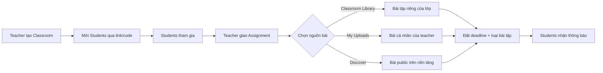
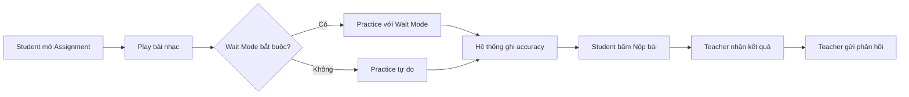
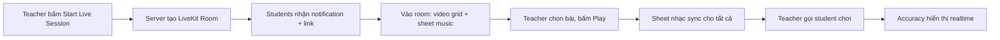

# Classroom & Marketplace — Phân tích tính năng

## 1. Classroom là gì?

Classroom là mô-đun **dạy-học trực tuyến** trong trụ cột **Học** (Learn) của Backing & Score. Nếu **Academy** là "sách giáo khoa" (ai cũng có thể tự học), thì **Classroom** là "lớp học thực tế" — nơi giáo viên và học viên tương tác trực tiếp.

```
Academy  = Khóa học tự học (1 → N người, không giám sát)
Classroom = Lớp học có giáo viên (1 teacher → N students, có giám sát)
```

## 2. Đối tượng sử dụng

| Vai trò | Mô tả |
|---------|-------|
| **Teacher** | Giáo viên nhạc, người có tài khoản Creator. Tạo lớp, giao bài, chấm điểm |
| **Student** | Học viên tham gia lớp qua link mời hoặc mã lớp |
| **Admin** | Quản trị viên nền tảng, xem thống kê tổng quan |

## 3. Các chức năng chính

### 3.1 Quản lý Lớp học (Teacher)

| Chức năng | Mô tả |
|-----------|-------|
| **Tạo lớp** | Đặt tên, mô tả, ảnh bìa. Chọn nhạc cụ/trình độ mục tiêu |
| **Mời học viên** | Tạo link mời hoặc mã lớp (class code). Học viên bấm link → tự động tham gia |
| **Danh sách thành viên** | Xem, xóa, hoặc đặt trạng thái học viên (active / inactive) |
| **Quản lý Classroom Library** | Tạo bài tập riêng cho lớp (exercises ngắn), tổ chức theo folder/chủ đề |
| **Giao bài tập** | Chọn từ: Classroom Library, My Uploads, hoặc Discover → giao cho lớp với deadline |
| **Tạo bài kiểm tra** | Giao bài có Wait Mode bắt buộc → hệ thống tự chấm điểm accuracy |
| **Xem tiến trình** | Dashboard tổng quan: ai đã hoàn thành, ai chưa, điểm trung bình |
| **Phản hồi** | Gửi nhận xét text cho từng học viên về từng bài tập |

### 3.2 Trải nghiệm Học viên (Student)

| Chức năng | Mô tả |
|-----------|-------|
| **Tham gia lớp** | Bấm link mời hoặc nhập mã lớp |
| **Xem bài tập** | Danh sách bài tập được giao, deadline, trạng thái (chưa làm / đang làm / đã nộp) |
| **Luyện tập** | Mở bài tập → chuyển thẳng sang Play Mode / Wait Mode |
| **Nộp bài** | Sau khi practice, bấm "Nộp bài" → kết quả (accuracy, thời gian) tự động gửi về teacher |
| **Xem phản hồi** | Đọc nhận xét từ giáo viên |
| **Xem tiến trình cá nhân** | Biểu đồ tiến bộ: accuracy theo thời gian, bài đã hoàn thành |

### 3.3 Bài tập & Chấm điểm

```
Teacher tạo bài tập trong Classroom Library (hoặc chọn từ Discover / My Uploads)
    ↓
Teacher giao bài tập cho lớp (đặt deadline + loại bài)
    ↓
Student mở bài → Play/Wait Mode
    ↓
Hệ thống ghi lại: accuracy %, tempo đạt được, số lần thử
    ↓
Student bấm "Nộp bài"
    ↓
Teacher xem kết quả + gửi phản hồi
```

**Loại bài tập:**

| Loại | Mô tả | Cách chấm |
|------|-------|-----------|
| **Practice** | Luyện tập tự do, không chấm điểm | Chỉ ghi nhận đã hoàn thành |
| **Assessment** | Bài kiểm tra, bật Wait Mode bắt buộc | Tự động: accuracy %, completion time |
| **Performance** | Chơi toàn bài, không dừng | Tự động: accuracy % + teacher review |

### 3.4 Practice Recording & Audio Submission

> **Mục tiêu:** Student có thể thu âm bản chơi của mình khi luyện tập, rồi gửi kèm khi nộp bài. Teacher nghe trực tiếp trong Submissions list để đánh giá musicality, dynamics, phrasing — không chỉ dựa vào con số accuracy.

**UX Flow chính — Record trong Play Mode:**

```
Student mở assignment → bấm "Practice" → vào Play Mode
    ↓
Bấm nút 🔴 Record (cạnh Play/Pause) → browser xin quyền mic
    ↓
Bấm Play → backing track chạy + mic thu âm đồng thời
    ↓
Bài kết thúc hoặc student bấm Stop → recording tự dừng
    ↓
Hiện preview: "Listen to your recording" + nút Play lại
    ↓
[Hài lòng] → "Submit this recording" → auto-upload + nộp bài
[Không hài lòng] → "Try again" → record lại
```

**Fallback — Upload file:**

Tại trang Assignment Detail, có link phụ: _"Or upload an existing recording"_ → student chọn file mp3/m4a từ device (giới hạn 10MB).

**Technical Implementation:**

| Thành phần | Chi tiết |
|------------|----------|
| **Recording API** | `MediaRecorder` (browser native), output WebM/Opus |
| **Conversion** | Client-side encode sang MP3 bằng `lamejs` (optional, WebM cũng OK) |
| **Storage** | Appwrite Storage bucket: `classroom_recordings` |
| **Data** | Thêm `recordingFileId` vào `SubmissionDocument` |
| **Playback** | Inline `<audio>` player trong teacher's Submission list |
| **Security** | File permission: `Role.users()` read (teacher + student đều nghe được) |
| **Size limit** | Client-side: max 10MB. Nếu vượt → hiện cảnh báo, gợi ý record ngắn hơn |

## 4. Luồng hoạt động chính

### 4.1 Classroom Library — Kho bài tập riêng

> **Vấn đề:** Discover chứa tác phẩm hoàn chỉnh đã publish. Trong dạy nhạc thực tế, giáo viên cần tạo **bài tập ngắn** (8-16 ô nhịp) nhắm vào kỹ thuật cụ thể — không cần và không nên public.

| | **Discover** | **My Uploads** | **Classroom Library** |
|---|---|---|---|
| Visibility | Public | Chỉ owner | Teacher + students trong lớp |
| Mục đích | Showcase, khám phá | Quản lý cá nhân | Bài tập có tổ chức cho lớp |
| Tổ chức | Tags, categories | Flat list | **Folders** theo chủ đề |
| Nội dung | Tác phẩm hoàn chỉnh | Bất kỳ | Exercises ngắn, luyện kỹ thuật |
| Ví dụ | "Moonlight Sonata" | Bản draft đang soạn | "Gam C trưởng — 16 ô nhịp" |

**Cấu trúc Classroom Library:**
```
Classroom Library của "Lớp Piano Cơ bản"
├── 📁 Gam & Hợp âm
│   ├── Gam C trưởng (8 ô nhịp)
│   ├── Gam A thứ (8 ô nhịp)
│   └── Hợp âm I-IV-V-I (4 ô nhịp)
├── 📁 Bài đọc nốt (Sight Reading)
│   ├── Bài đọc nốt #1 — Nhịp 4/4
│   └── Bài đọc nốt #2 — Nhịp 3/4
├── 📁 Etude
│   ├── Etude tay phải #1
│   └── Etude tay trái #1
└── 📁 Thi cuối kỳ
    └── Đề thi Piano Grade 1
```

Teacher tạo exercise bằng cùng editor đã có (upload MusicXML + audio stems), nhưng bài tập **chỉ visible cho thành viên lớp** và được tổ chức theo **folder** thay vì tags.

### 4.2 Teacher giao bài



### 4.3 Student hoàn thành bài tập



## 5. Dữ liệu cần lưu trữ (Appwrite Collections)

| Collection | Mô tả | Trường chính |
|-----------|-------|-------------|
| `classrooms` | Lớp học | name, description, teacherId, coverImage, instrumentFocus, level, classCode, status |
| `classroom_members` | Thành viên lớp | classroomId, userId, role (teacher/student), joinedAt, status |
| `exercise_folders` | Thư mục bài tập | classroomId, name, order, parentFolderId (null = root) |
| `classroom_exercises` | Bài tập trong Library | classroomId, folderId, projectId, title, description, createdAt |
| `assignments` | Bài được giao | classroomId, title, description, sourceType (library/upload/discover), sourceId, type (practice/assessment/performance), deadline, waitModeRequired, createdAt |
| `submissions` | Kết quả nộp bài | assignmentId, studentId, accuracy, tempo, attempts, completedAt, submittedAt, status (draft/submitted/reviewed) |
| `feedback` | Phản hồi của teacher | submissionId, teacherId, content, createdAt |

### Marketplace Collections (thêm mới)

| Collection | Mô tả | Trường chính |
|-----------|-------|-------------|
| `teacher_profiles` | Hồ sơ dạy học | userId, bio, instruments[], languages[], hourlyRate, currency, videoIntroUrl, isListed, timezone |
| `availability` | Lịch trống | teacherId, dayOfWeek, startTime, endTime, recurring |
| `bookings` | Buổi học đã đặt | teacherId, studentId, datetime, durationMin, price, commission, status (pending/confirmed/completed/cancelled), livekitRoomId |
| `reviews` | Đánh giá sau buổi học | bookingId, studentId, teacherId, rating (1-5), content, createdAt |
| `payouts` | Lịch sử rút tiền | teacherId, amount, stripeTransferId, status, createdAt |

## 6. Giao diện (UI Pages)

| Route | Mô tả | Quyền |
|-------|-------|-------|
| `/classroom` | Danh sách lớp học của user | All |
| `/classroom/create` | Tạo lớp mới | Teacher |
| `/classroom/[id]` | Chi tiết lớp: bài tập, thành viên, tiến trình | Teacher + Students trong lớp |
| `/classroom/[id]/library` | **Classroom Library** — kho bài tập riêng, tổ chức theo folder | Teacher (edit) + Students (view) |
| `/classroom/[id]/assign` | Giao bài tập mới (chọn từ Library / Uploads / Discover) | Teacher |
| `/classroom/[id]/progress` | Dashboard tiến trình toàn lớp | Teacher |
| `/classroom/[id]/assignment/[aid]` | Chi tiết bài tập + nộp bài | Student |
| `/classroom/join/[code]` | Tham gia lớp qua mã | All |

### Marketplace Routes (thêm mới)

| Route | Mô tả | Quyền |
|-------|-------|-------|
| `/teachers` | Tìm kiếm teacher — lọc theo nhạc cụ, ngôn ngữ, giá, rating | All |
| `/teachers/[id]` | Profile teacher: bio, video intro, reviews, lịch trống | All |
| `/teachers/[id]/book` | Đặt lịch buổi học 1:1 + thanh toán | Student |
| `/dashboard/earnings` | Dashboard thu nhập, lịch sử, rút tiền | Teacher |

## 7. Tích hợp với hệ thống hiện có

| Module hiện tại | Tích hợp với Classroom |
|----------------|----------------------|
| **Play Mode / Wait Mode** | Student practice bài tập → hệ thống ghi lại accuracy, tempo |
| **Project Editor** | Teacher dùng cùng editor (MusicXML + stems) để tạo exercises trong Classroom Library |
| **Discover / My Uploads** | Nguồn bài bổ sung khi giao bài tập (ngoài Classroom Library) |
| **Notifications** | Thông báo khi: bài tập mới, deadline sắp hết, teacher phản hồi |
| **Dashboard** | Thêm tab "My Classrooms" trong Dashboard |
| **Feed** | Teacher/Student có thể share tiến trình lớp lên Feed |
| **Subscription** | Classroom có thể là tính năng Premium hoặc có tier riêng cho giáo viên |

---

## 8. Giao tiếp trong Classroom

### 8.1 Class Chat (text + hình)
- Chat nhóm toàn lớp, tất cả thành viên thấy
- Triển khai bằng **Appwrite Realtime** + collection `classroom_messages`
- Gửi tài liệu, hình ảnh, link bài tập

### 8.2 Assignment Feedback
- Teacher gửi nhận xét text trên từng submission của student
- Đã có trong data model (`feedback` collection)

### 8.3 Live Lesson (Video Call) — LiveKit Cloud

**Công nghệ:** [LiveKit Cloud](https://livekit.io/) — managed WebRTC platform
- React SDK: `@livekit/components-react`
- Free tier: 50,000 participant-minutes/tháng
- Low latency — quan trọng cho dạy nhạc
- Screen share, recording built-in

**Giao diện Live Lesson:**
```
┌───────────────────────────────────────────────┐
│  🎵 Live Lesson          [Participants] [End]  │
├─────────────────────────┬─────────────────────┤
│                         │ 👤 Teacher (cam)    │
│  ♫ Sheet Music           │ ────────────────── │
│  (Play Mode đồng bộ)     │ 👤 Student 1 (cam)  │
│                         │ ────────────────── │
│  [▶ Play] [Wait Mode]    │ 👤 Student 2 (cam)  │
│  Accuracy: 87%          │ ────────────────── │
│                         │ 💬 Chat             │
├─────────────────────────┴─────────────────────┤
│  [🎙 Mic] [📷 Cam] [💻 Share] [✋ Raise Hand]    │
└───────────────────────────────────────────────┘
```

**Killer features chỉ Backing & Score có:**

| Tính năng | Mô tả |
|-----------|-------|
| **Synced Sheet Music** | Teacher và student cùng thấy sheet nhạc, cùng playhead position |
| **Live Accuracy** | Teacher thấy realtime student đang chơi đúng/sai nốt nào |
| **"Your turn" mode** | Teacher unmute 1 student, cả lớp nghe và thấy accuracy |
| **Lesson Recording** | Ghi lại buổi học để student xem lại (LiveKit recording API) |

**Luồng hoạt động:**


### 8.4 Giai đoạn triển khai giao tiếp

| Tính năng | Phase | Độ khó |
|-----------|-------|--------|
| Assignment feedback (text) | MVP | Thấp |
| Class Chat (text + hình) | MVP | Trung bình |
| Live Session (LiveKit) | Phase 2 | Trung bình |
| Synced Play Mode in call | Phase 3 | Cao |
| Lesson Recording | Phase 3 | Thấp (LiveKit API) |

---

## 8. Giá trị kinh doanh

### Cho nền tảng:
- **Viral loop mạnh nhất**: Teacher share link lớp → 20-30 students phải đăng ký → organic growth
- **Retention cao**: Student quay lại hàng ngày vì có deadline, bài tập
- **Upsell tự nhiên**: Teacher cần Premium để tạo lớp, students cần Premium cho Wait Mode unlimited
- **Dữ liệu giá trị**: Practice data → AI đề xuất cải thiện (tương lai)

### Cho giáo viên:
- **Giảm tải quản lý**: Không cần chấm bài thủ công, hệ thống tự ghi nhận
- **Dạy từ xa hiệu quả**: Giao bài → students tự practice ở nhà → teacher chỉ cần review kết quả
- **Chuyên nghiệp hóa**: Công cụ dạy nhạc hiện đại, khác biệt so với dạy truyền thống

### Cho học viên:
- **Có lộ trình rõ ràng**: Biết phải tập gì, bao giờ xong
- **Feedback nhanh**: Hệ thống tự chấm + teacher nhận xét
- **Động lực**: Deadline, so sánh tiến trình với lớp

## 9. Phân biệt Academy vs Classroom

| | **Academy** | **Classroom** |
|---|---|---|
| Mô hình | Tự học (self-paced) | Có giáo viên (instructor-led) |
| Nội dung | Khóa học cố định, ai cũng học giống nhau | Bài tập tùy chỉnh theo lớp |
| Tiến trình | Tự quản lý | Teacher theo dõi + phản hồi |
| Deadline | Không có | Có deadline cho mỗi bài |
| Chấm điểm | Tự động (pass/fail) | Tự động + teacher review |
| Tương tác | Không | Teacher ↔ Student |
| Phù hợp | Người tự học, hobbyist | Trường nhạc, lớp dạy nhạc private |

## 10. Giai đoạn triển khai đề xuất

### Phase 1 — MVP (2-3 tuần)
- [ ] Tạo/xóa Classroom
- [ ] Invite link + class code
- [ ] **Classroom Library**: tạo folder + tạo exercise (dùng lại Project Editor)
- [ ] Giao bài tập (chọn từ Library / My Uploads / Discover)
- [ ] Student xem + practice bài tập
- [ ] Nộp bài cơ bản (ghi nhận accuracy)

### Phase 2 — Teacher Dashboard (1-2 tuần)
- [ ] Bảng tiến trình toàn lớp (ai hoàn thành / chưa)
- [ ] Phản hồi text cho từng submission
- [ ] Notifications cho deadline + phản hồi

### Phase 3 — Nâng cao (2+ tuần)
- [ ] Bài kiểm tra với Wait Mode bắt buộc
- [ ] Biểu đồ tiến bộ cá nhân (accuracy theo thời gian)
- [ ] So sánh ẩn danh với lớp (motivation)
- [ ] Tích hợp Academy (giao cả bài Academy vào Classroom)
- [ ] Teacher subscription tier

### Phase 4 — Marketplace / italki for Music (4-6 tuần)
- [ ] Teacher Profile & Listing (`/teachers/[id]`)
- [ ] Teacher Discovery page (`/teachers`) — tìm kiếm, lọc nhạc cụ/ngôn ngữ/giá
- [ ] Booking & Scheduling (calendar, time slots, timezone)
- [ ] Per-session payment (B&S giữ 15%)
- [ ] Trial lesson (30 phút giá rẻ)
- [ ] Reviews & Ratings sau mỗi buổi
- [ ] Teacher Earnings Dashboard + payout (Stripe Connect)
