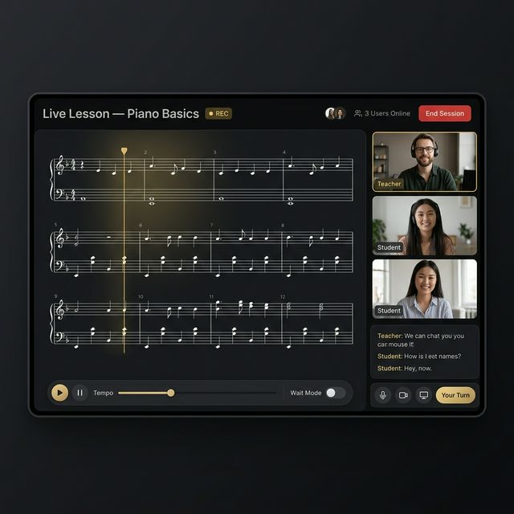
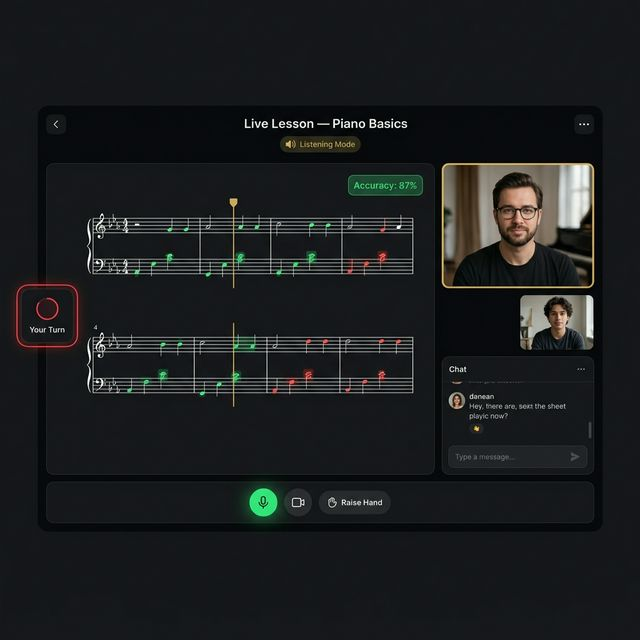
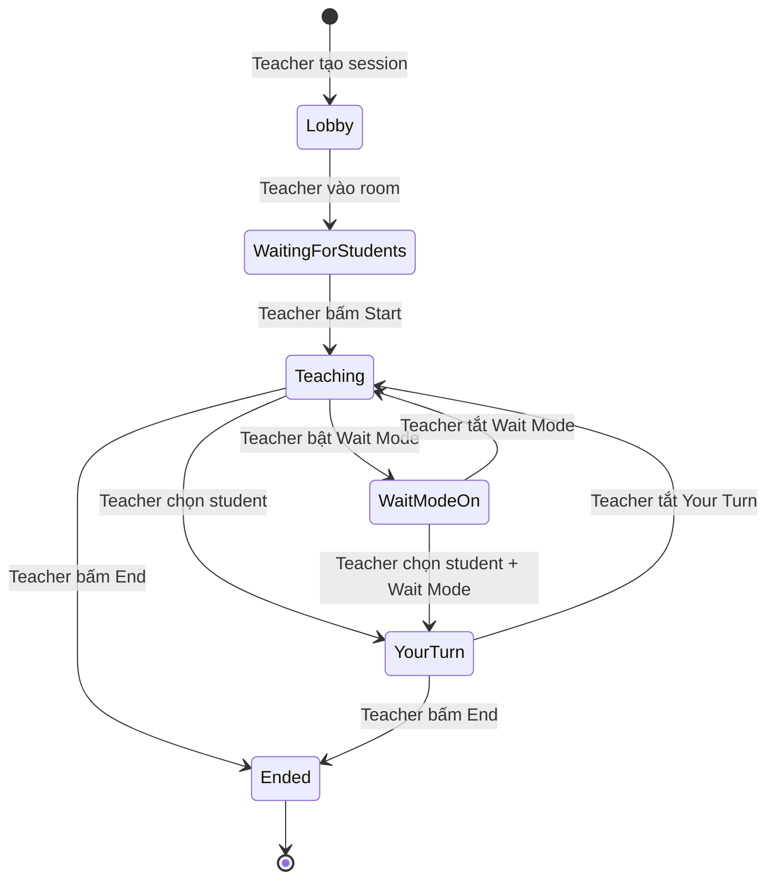
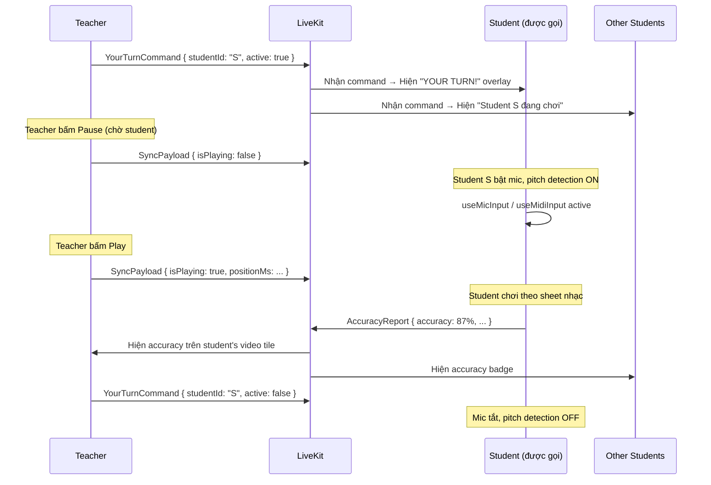

# Live Lesson — Thiết kế chi tiết

## 1. Tổng quan

Live Lesson cho phép teacher và students **cùng nhìn sheet nhạc realtime** trong một video call, với pitch detection và accuracy scoring tích hợp. Đây là killer feature không platform nào khác có.

**Tech stack:**
- **LiveKit Cloud** — managed WebRTC (video, audio, data channels)
- **`@livekit/components-react`** — React SDK tích hợp vào Next.js
- **`useScoreEngine`** — engine nhạc hiện có (đã quản lý playhead, Wait Mode, accuracy)
- **LiveKit Data Channel** — sync playback state (không sync audio)

---

## 2. Giao diện chi tiết

### 2.1 Teacher View



```
┌─────────────────────────────────────────────────────────────────┐
│  🎵 Live Lesson — Lớp Piano Cơ bản    ● REC   👥 5   [End]    │ ← Header
├────────────────────────────────────┬────────────────────────────┤
│                                    │                            │
│  ♫ Sheet Music (MusicXMLVisualizer)│  👤 Teacher     ← gold    │
│     • Playhead (gold line)         │     border                │
│     • Measure highlights           │  ─────────────────────    │
│     • Click-to-seek (teacher only) │  👤 Student 1             │
│                                    │  👤 Student 2             │
│  ┌───────────────────────────┐     │  👤 Student 3 (audio only)│
│  │ ▶ ⏸  ⏮ ⏭  Tempo: 80%   │     │                            │
│  │ 🎵 Wait Mode: ON         │     │  ─────────────────────    │
│  │ 🎯 Your Turn: [Student1] │     │  💬 Class Chat            │
│  └───────────────────────────┘     │  └─────────────────────┘  │
│                                    │                            │
├────────────────────────────────────┴────────────────────────────┤
│  [🎙 Mic] [📷 Cam] [💻 Share Screen] [✋ Your Turn] [⏺ Record] │
└─────────────────────────────────────────────────────────────────┘
```

**Teacher controls (chỉ teacher có):**
| Control | Chức năng |
|---------|-----------|
| ▶ / ⏸ Play/Pause | Phát/dừng nhạc — **sync cho tất cả students** |
| Tempo slider | Thay đổi tốc độ — sync cho tất cả |
| Wait Mode toggle | Bật/tắt Wait Mode — sync cho tất cả |
| Click-to-seek | Bấm vào ô nhịp → nhảy đến đó — sync cho tất cả |
| "Your Turn" button | Chọn 1 student → unmute mic, bật pitch detection cho student đó |
| Record | Ghi lại buổi học (LiveKit Egress API) |

### 2.2 Student View



```
┌─────────────────────────────────────────────────────────────────┐
│  Live Lesson — Lớp Piano Cơ bản    🔇 Listening Mode     [←]  │
├────────────────────────────────────┬────────────────────────────┤
│                                    │                            │
│  ♫ Sheet Music (read-only)         │  👤 Teacher (lớn, gold)   │
│     • Playhead auto-follows        │                            │
│     • KHÔNG THỂ click-to-seek      │  👤 Bạn (nhỏ, self-view) │
│     • Nốt đúng highlight xanh      │                            │
│     • Nốt sai highlight đỏ         │  ─────────────────────    │
│                                    │  💬 Chat                  │
│  ┌───────────────────────────┐     │                            │
│  │ 🎯 YOUR TURN! (khi được  │     │                            │
│  │    gọi, viền đỏ pulse)    │     │                            │
│  │ Accuracy: 87% ✅          │     │                            │
│  └───────────────────────────┘     │                            │
├────────────────────────────────────┴────────────────────────────┤
│  [🎙 Mic] [📷 Cam] [✋ Raise Hand]                              │
└─────────────────────────────────────────────────────────────────┘
```

**Student restrictions:**
| Bị khóa | Lý do |
|---------|-------|
| Play/Pause | Teacher điều khiển playback |
| Tempo | Teacher đặt tempo cho cả lớp |
| Seek (click measure) | Tránh mỗi student ở position khác nhau |
| Wait Mode toggle | Teacher quyết định khi nào bật Wait Mode |

**Student được phép:**
| Được phép | Lý do |
|-----------|-------|
| Zoom in/out sheet | Mỗi màn hình khác nhau |
| Chat | Giao tiếp |
| Raise Hand | Yêu cầu teacher chú ý |
| Mic/Cam toggle | Riêng tư |

---

## 3. Data Channel Protocol

### 3.1 Sync Payload (Teacher → Students)

Teacher broadcast **10-20 lần/giây** qua LiveKit Data Channel (reliable mode):

```ts
interface SyncPayload {
  type: "sync";
  positionMs: number;      // vị trí hiện tại (ms)
  isPlaying: boolean;      // đang phát hay dừng
  playbackRate: number;    // tốc độ (0.5 - 2.0)
  isWaitMode: boolean;     // Wait Mode on/off
  measureIndex: number;    // ô nhịp hiện tại
  timestamp: number;       // performance.now() của teacher
}
```

> **Kích thước mỗi message: ~100 bytes** × 20 msg/s = **2 KB/s** — không đáng kể.

### 3.2 Commands (Teacher → specific Student)

```ts
interface YourTurnCommand {
  type: "your_turn";
  studentId: string;       // ID student được gọi
  active: boolean;         // bật/tắt "Your Turn"
}

interface SeekCommand {
  type: "seek";
  positionMs: number;
}

interface ModeCommand {
  type: "mode";
  isWaitMode: boolean;
  playbackRate: number;
}
```

### 3.3 Student → Teacher (accuracy report)

```ts
interface AccuracyReport {
  type: "accuracy";
  studentId: string;
  accuracy: number;        // 0-100%
  currentMeasure: number;
  notesHit: number;
  notesMissed: number;
}
```

### 3.4 Tại sao Data Channel, không phải WebSocket?

| | LiveKit Data Channel | WebSocket riêng |
|---|---|---|
| Latency | ~50ms (cùng connection với video) | ~100ms+ (connection riêng) |
| Setup | Không cần — đã có trong LiveKit | Cần server riêng |
| Reliability | Reliable + Unreliable modes | Reliable only |
| Firewall | Đã xuyên qua cùng port với video | Có thể bị block |

---

## 4. State Machine



### 4.1 Các trạng thái chi tiết

| State | Teacher UI | Student UI |
|-------|-----------|-----------|
| **Lobby** | Tạo session, chọn bài nhạc, đặt settings | — |
| **WaitingForStudents** | Thấy ai đã vào, nút "Start Lesson" | Màn hình chờ "Teacher sắp bắt đầu" |
| **Teaching** | Full controls, broadcast sync | Sheet follow playhead, mic muted |
| **YourTurn** | "Your Turn: [Student X]" indicator | Student X: mic unmuted, pitch detect ON, accuracy hiển thị. Others: xem accuracy của X |
| **WaitModeOn** | Wait Mode controls, thấy accuracy | Sheet dừng tại mỗi nốt |
| **Ended** | Summary: thời lượng, students attended | Summary + link recording |

---

## 5. Component Architecture

```
LiveLessonPage (route: /classroom/[id]/live)
├── LiveLessonProvider (context: room state, sync state)
│   ├── LiveLessonHeader
│   │   ├── Lesson title, REC indicator
│   │   ├── ParticipantCount
│   │   └── EndButton
│   │
│   ├── LiveLessonBody (flex layout)
│   │   ├── SheetMusicPanel (70%)
│   │   │   ├── MusicXMLVisualizer (existing)
│   │   │   │   • positionMs from SyncPayload (student)
│   │   │   │   • positionMs from useScoreEngine (teacher)
│   │   │   ├── YourTurnOverlay (conditional)
│   │   │   └── AccuracyBadge (conditional)
│   │   │
│   │   └── SidePanel (30%)
│   │       ├── VideoGrid
│   │       │   ├── ParticipantTile (LiveKit component)
│   │       │   └── SelfView
│   │       └── ClassChat
│   │
│   ├── TeacherControls (teacher only)
│   │   ├── PlayPauseButton → broadcasts SyncPayload
│   │   ├── TempoSlider → broadcasts ModeCommand
│   │   ├── WaitModeToggle → broadcasts ModeCommand
│   │   └── YourTurnSelector → broadcasts YourTurnCommand
│   │
│   └── StudentControls (student only)
│       ├── MicToggle
│       ├── CamToggle
│       └── RaiseHandButton
│
└── LiveLessonToolbar
    ├── MicButton, CamButton, ShareButton
    └── RecordButton (teacher only)
```

### 5.1 Tận dụng code hiện có

| Component hiện có | Dùng lại trong Live Lesson | Thay đổi |
|-------------------|---------------------------|----------|
| `MusicXMLVisualizer` | ✅ Render sheet nhạc | Thêm prop `externalPositionMs` cho student mode |
| `PlayerControls` | ⚠️ Tùy chỉnh | Teacher: full controls. Student: read-only |
| `useScoreEngine` | ✅ Teacher's engine | Student KHÔNG dùng — chỉ nhận sync state |
| `useMicInput` | ✅ "Your Turn" mode | Chỉ active khi student được gọi |
| `useMidiInput` | ✅ "Your Turn" mode | Chỉ active khi student được gọi |

### 5.2 Quan trọng: Student KHÔNG chạy useScoreEngine

```
Teacher:
  useScoreEngine (full) → positionMs, isPlaying, etc.
       ↓ broadcast via Data Channel
Student:
  Nhận SyncPayload → set externalPositionMs
       ↓
  MusicXMLVisualizer renders tại position đó
  (KHÔNG có AudioManager, KHÔNG có MIDI player)
```

Student chỉ cần **1 biến**: `positionMs` — mọi thứ khác (scroll, playhead, measure highlight) đã được `MusicXMLVisualizer` xử lý.

---

## 6. "Your Turn" Mode — Chi tiết

Đây là interaction phức tạp nhất, cần thiết kế kỹ:



### 6.1 UI khi "Your Turn" active

**Student được gọi:**
- Viền đỏ pulse quanh sheet music
- Banner "YOUR TURN!" nổi bật
- Mic tự unmute (có thể mute lại)
- Accuracy badge hiện realtime
- Pitch detection ON (dùng `useMicInput` / `useMidiInput` hiện có)

**Teacher:**
- Indicator "🎯 Your Turn: [Student Name]"
- Accuracy số liệu realtime trên video tile của student
- Nút để tắt "Your Turn"

**Other students:**
- Thấy ai đang được gọi
- Thấy accuracy badge của student đó
- Sheet nhạc vẫn sync bình thường

---

## 7. Xử lý Edge Cases

| Edge Case | Giải pháp |
|-----------|-----------|
| **Student mất mạng** | Khi reconnect, nhận SyncPayload mới nhất → jump-to-position. Hiện "Reconnecting..." overlay |
| **Teacher mất mạng** | Students thấy "Teacher disconnected". Playback pause. Tự reconnect trong 30s |
| **Latency spike** | Student dùng interpolation: smooth playhead movement dựa trên `playbackRate` + last known `positionMs` |
| **Student vào muộn** | Nhận SyncPayload ngay → jump-to-position, thấy sheet đúng vị trí |
| **Quá nhiều participants** | LiveKit Cloud scale tự động. Video grid chuyển sang pagination khi >6 participants |
| **Mobile student** | Responsive layout: video panel ẩn, chỉ sheet music + pip teacher video |
| **Browser không hỗ trợ mic** | "Your Turn" disabled cho student đó, hiện warning |

### 7.1 Interpolation Algorithm (Student side)

```ts
// Student receives SyncPayload every ~50-100ms
// Between payloads, interpolate position for smooth playhead

let lastSync = { positionMs: 0, timestamp: 0, playbackRate: 1 };

function onSyncReceived(payload: SyncPayload) {
  lastSync = payload;
}

function getCurrentPosition(): number {
  if (!lastSync.isPlaying) return lastSync.positionMs;
  
  const elapsed = performance.now() - lastSync.timestamp;
  // Adjust for network latency (~50ms)
  const networkDelay = 50;
  return lastSync.positionMs + (elapsed - networkDelay) * lastSync.playbackRate;
}

// Called every frame via requestAnimationFrame
function updatePlayhead() {
  const pos = getCurrentPosition();
  visualizer.setExternalPosition(pos);
  requestAnimationFrame(updatePlayhead);
}
```

---

## 8. Responsive Layout

### Desktop (>1024px)
```
[Sheet Music 70%] [Video + Chat 30%]
```

### Tablet (768-1024px)
```
[Sheet Music 100%]
[Video Grid (horizontal scroll) + Chat (overlay)]
```

### Mobile (<768px)
```
[Sheet Music 100%]
[Teacher PiP (floating, draggable)]
[Chat (slide-up panel)]
```

---

## 9. Giai đoạn triển khai

### Phase 1: Core Video Call (1 tuần)
- [ ] LiveKit Cloud setup (API key, webhook)
- [ ] `/classroom/[id]/live` route
- [ ] `LiveLessonProvider` context (room connection)
- [ ] Video grid (LiveKit components)
- [ ] Basic controls (mic, cam, end)
- [ ] Teacher creates room → students join via link

### Phase 2: Synced Sheet Music (1 tuần)
- [ ] Teacher's `useScoreEngine` broadcasts `SyncPayload` via Data Channel
- [ ] Student receives sync → `MusicXMLVisualizer` follows
- [ ] Interpolation algorithm for smooth playhead
- [ ] Teacher controls: Play/Pause/Seek/Tempo sync
- [ ] Student UI: read-only sheet, following playhead

### Phase 3: "Your Turn" Mode (1 tuần)
- [ ] `YourTurnCommand` via Data Channel
- [ ] Student: auto-activate mic + pitch detection (`useMicInput`)
- [ ] `AccuracyReport` from student → teacher + all
- [ ] UI: "YOUR TURN" overlay, accuracy badge, pulsing border
- [ ] "Raise Hand" feature

### Phase 4: Polish (1 tuần)
- [ ] Reconnection handling
- [ ] Mobile responsive layout
- [ ] Class Chat within live session
- [ ] Recording (LiveKit Egress API)
- [ ] Session summary (duration, participants, accuracy stats)

**Tổng estimate: ~4 tuần**
