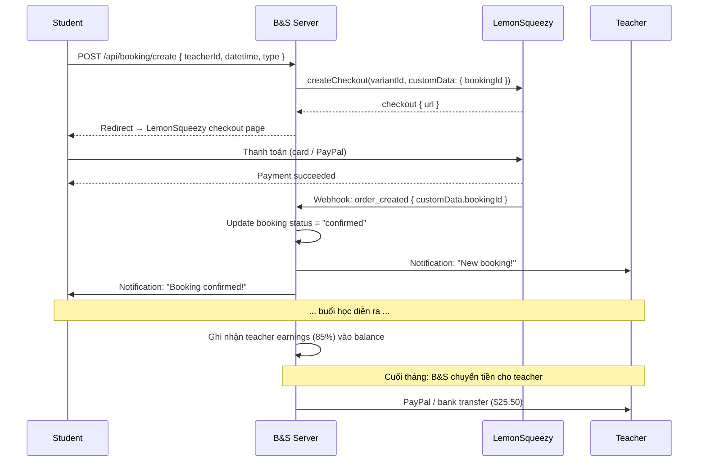
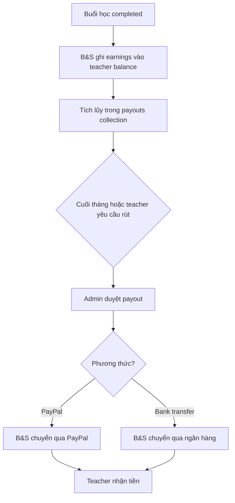
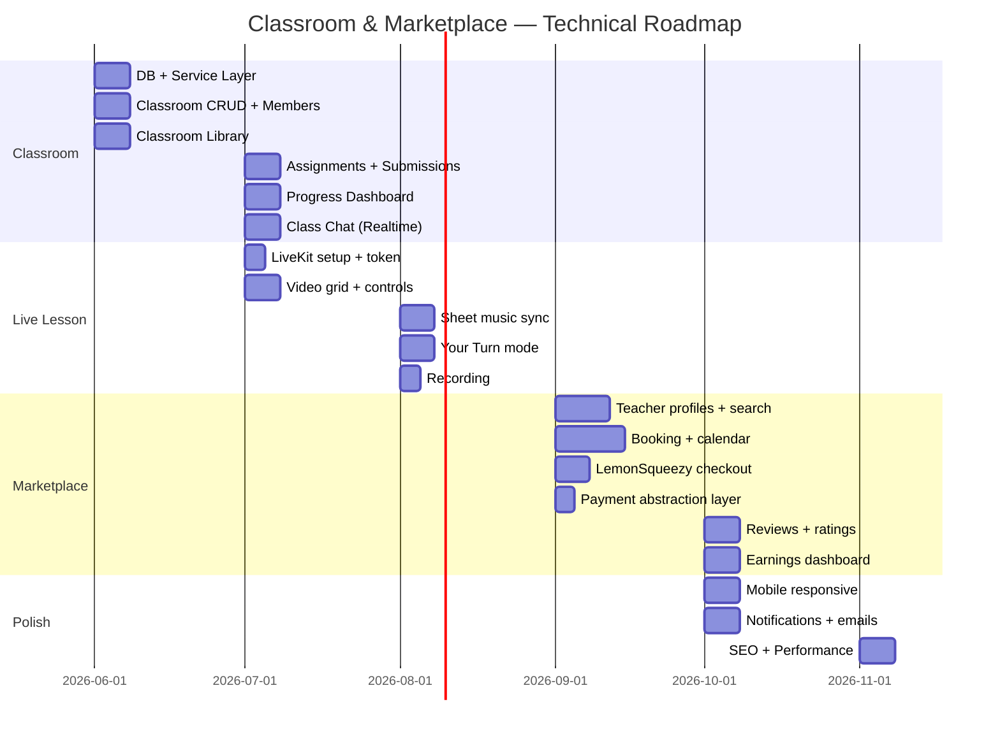

# Classroom & Marketplace — Thiết Kế Hệ Thống

**Phiên bản:** 1.0  
**Cập nhật:** 2026-03-27  
**Phần mở rộng cho:** `system_design.md` (hệ thống chính)

---

## Mục Lục

1. [Tổng Quan Kiến Trúc](#1-tổng-quan-kiến-trúc)
2. [Sơ Đồ Kiến Trúc Mở Rộng](#2-sơ-đồ-kiến-trúc-mở-rộng)
3. [Tech Stack Bổ Sung](#3-tech-stack-bổ-sung)
4. [Thiết Kế Cơ Sở Dữ Liệu](#4-thiết-kế-cơ-sở-dữ-liệu)
5. [API Design (Service Layer)](#5-api-design)
6. [Real-time Infrastructure](#6-real-time-infrastructure)
7. [Live Lesson — Sync Protocol](#7-live-lesson--sync-protocol)
8. [Thanh Toán & Payout](#8-thanh-toán--payout)
9. [Xác Thực & Phân Quyền](#9-xác-thực--phân-quyền)
10. [Thông Báo (Notifications)](#10-thông-báo)
11. [Search & Discovery](#11-search--discovery)
12. [Hiệu Năng & Scale](#12-hiệu-năng--scale)
13. [Bảo Mật](#13-bảo-mật)
14. [Rủi Ro Kỹ Thuật](#14-rủi-ro-kỹ-thuật)
15. [Roadmap Kỹ Thuật](#15-roadmap-kỹ-thuật)

---

## 1. Tổng Quan Kiến Trúc

### 1.1 Nguyên tắc thiết kế

Classroom & Marketplace tuân thủ kiến trúc **Client-Heavy** hiện có, bổ sung thêm:

| Nguyên tắc | Áp dụng |
|---|---|
| **Reuse tối đa** | Live Lesson dùng lại `useScoreEngine`, `MusicXMLVisualizer`, `PlayerControls` |
| **LiveKit = Real-time layer** | Không build WebRTC từ đầu, dùng managed service |
| **LemonSqueezy = Payment layer** | Dùng LemonSqueezy (MoR) cho cả subscription lẫn marketplace. Abstraction layer để tương lai swap sang Stripe Connect |
| **Appwrite Realtime** | Chat, notifications — dùng infrastructure đã có |
| **Stateless sync** | Teacher broadcast state → students render local, không shared state |

### 1.2 Module mới vs Module tái sử dụng

```
┌─────── MỚI ──────────────────────────────────────────────────┐
│ Classroom Module │ Marketplace Module │ LiveKit Integration   │
│ (classes, assign │ (profiles, booking │ (video, data channel) │
│  library, submit)│  payment, review)  │                       │
├─────── TÁI SỬ DỤNG ─────────────────────────────────────────┤
│ useScoreEngine │ MusicXMLVisualizer │ PlayerControls         │
│ useMicInput    │ useMidiInput       │ AuthContext            │
│ Appwrite SDK   │ Notification system│ UpgradePrompt          │
└──────────────────────────────────────────────────────────────┘
```

---

## 2. Sơ Đồ Kiến Trúc Mở Rộng

```
┌─────────────────────────────────────────────────────────────────────────┐
│                         PRESENTATION LAYER                              │
│  Next.js App Router                                                     │
│                                                                         │
│  Mới: /classroom │ /classroom/[id]/live │ /teachers │ /teachers/[id]   │
│       /teachers/[id]/book │ /dashboard/earnings                         │
└────────────────────────────────┬────────────────────────────────────────┘
                                 │
┌────────────────────────────────▼────────────────────────────────────────┐
│                        APPLICATION LAYER                                │
│                                                                         │
│  ┌──────────────┐  ┌──────────────┐  ┌──────────────┐                  │
│  │ Classroom     │  │ Marketplace   │  │ Live Lesson   │                 │
│  │ Shell         │  │ Pages         │  │ Shell         │                 │
│  │              │  │              │  │              │                    │
│  │ ClassList    │  │ TeacherDiscov│  │ LiveLesson   │                    │
│  │ AssignView   │  │ TeacherProf  │  │  Provider    │                    │
│  │ LibraryView  │  │ BookingFlow  │  │ SheetPanel   │                    │
│  │ ProgressView │  │ EarningsDash │  │ VideoGrid    │                    │
│  │ SubmissionV  │  │ ReviewsList  │  │ ClassChat    │                    │
│  └──────┬───────┘  └──────┬───────┘  └──────┬───────┘                   │
│         │                 │                 │                            │
│  ┌──────▼─────────────────▼─────────────────▼───────┐                   │
│  │                  HOOKS LAYER                      │                   │
│  │                                                   │                   │
│  │  useScoreEngine (reuse)    │ useLiveLesson (NEW)  │                   │
│  │  useMicInput    (reuse)    │ useClassroom  (NEW)  │                   │
│  │  useMidiInput   (reuse)    │ useBooking    (NEW)  │                   │
│  └──────────────────────┬────────────────────────────┘                   │
└─────────────────────────┬───────────────────────────────────────────────┘
                          │
┌─────────────────────────▼───────────────────────────────────────────────┐
│                          DATA LAYER                                      │
│                                                                         │
│  src/lib/appwrite/              │  src/lib/livekit/   │ src/lib/stripe/ │
│  ┌──────────────┐               │  ┌──────────────┐   │ ┌─────────────┐│
│  │classrooms.ts │ (NEW)         │  │livekit.ts    │   │ │connect.ts   ││
│  │assignments.ts│ (NEW)         │  │              │   │ │checkout.ts  ││
│  │submissions.ts│ (NEW)         │  │ createRoom() │   │ │payout.ts    ││
│  │classroom     │               │  │ getToken()   │   │ └─────────────┘│
│  │ Messages.ts  │ (NEW)         │  │ sendData()   │   │               │
│  ├──────────────┤               │  └──────────────┘   │               │
│  │teachers.ts   │ (NEW)         │                     │               │
│  │bookings.ts   │ (NEW)         │                     │               │
│  │reviews.ts    │ (NEW)         │                     │               │
│  │payouts.ts    │ (NEW)         │                     │               │
│  ├──────────────┤               │                     │               │
│  │projects.ts   │ (existing)    │                     │               │
│  │social.ts     │ (existing)    │                     │               │
│  │notifications │ (existing)    │                     │               │
│  └──────────────┘               │                     │               │
└─────────────────────────────────┴─────────────────────┴───────────────┘
                          │
┌─────────────────────────▼───────────────────────────────────────────────┐
│                      INFRASTRUCTURE LAYER                                │
│                                                                         │
│  ┌─────────────────┐ ┌─────────────────┐ ┌─────────────────┐           │
│  │ Appwrite Cloud   │ │ LiveKit Cloud    │ │ LemonSqueezy     │          │
│  │ DB, Auth, Func,  │ │ WebRTC, DataCh,  │ │ Payments (MoR),  │          │
│  │ Realtime, Storage│ │ Recording        │ │ Subscriptions    │          │
│  └─────────────────┘ └─────────────────┘ └─────────────────┘           │
│                                                                         │
│  ┌─────────────────┐                                                    │
│  │ Vercel Edge      │  Tương lai: Stripe Connect khi có US entity       │
│  │ CDN, SSR, Func   │                                                    │
│  └─────────────────┘                                                    │
└─────────────────────────────────────────────────────────────────────────┘
```

---

## 3. Tech Stack Bổ Sung

| Thư viện / Service | Vai trò | Loại |
|---|---|---|
| `livekit-server-sdk` | Server-side: tạo room, token | Backend |
| `@livekit/components-react` | React components: VideoTrack, AudioTrack | Frontend |
| `livekit-client` | Client SDK: kết nối room, data channel | Frontend |
| `@lemonsqueezy/lemonsqueezy.js` | LemonSqueezy SDK — products, variants, checkouts | Payment |
| `date-fns` / `date-fns-tz` | Xử lý timezone cho booking | Utility |

> **Tương lai (khi có US entity):** thêm `stripe`, `@stripe/stripe-js`, swap `IPaymentProvider`.

---

## 4. Thiết Kế Cơ Sở Dữ Liệu

### 4.1 ER Diagram — Classroom

```
┌──────────────┐       ┌──────────────────┐       ┌──────────────────┐
│  classrooms  │       │ classroom_members │       │ exercise_folders  │
│              │◄──────│                  │       │                  │
│ $id          │   ┌──►│ classroomId      │       │ classroomId      │
│ name         │   │   │ userId           │       │ name             │
│ description  │   │   │ role             │       │ order            │
│ teacherId ───┼───┘   │ joinedAt         │       │ parentFolderId   │
│ coverImage   │       │ status           │       └────────┬─────────┘
│ instrument   │       └──────────────────┘                │
│ level        │                                   ┌───────▼─────────┐
│ classCode    │       ┌──────────────────┐        │classroom_exercis│
│ status       │◄──────│   assignments    │        │                 │
└──────────────┘       │                  │        │ classroomId     │
                       │ classroomId      │        │ folderId        │
                       │ title            │        │ projectId ──────┼──► projects
                       │ sourceType       │        │ title           │
                       │ sourceId ────────┼──►     │ description     │
                       │ type             │ (lib/  └─────────────────┘
                       │ deadline         │  upload/
                       │ waitModeRequired │  discover)
                       └────────┬─────────┘
                                │
                       ┌────────▼─────────┐       ┌──────────────────┐
                       │  submissions     │       │    feedback       │
                       │                  │──────►│                  │
                       │ assignmentId     │       │ submissionId     │
                       │ classroomId      │       │ teacherId        │
                       │ studentId        │       │ content          │
                       │ studentName      │       │ createdAt        │
                       │ accuracy         │       └──────────────────┘
                       │ tempo            │
                       │ attempts         │
                       │ recordingFileId──┼──► Appwrite Storage
                       │ submittedAt      │       (classroom_recordings)
                       │ status           │
                       └──────────────────┘

                       ┌──────────────────┐
                       │classroom_messages│
                       │                  │
                       │ classroomId      │
                       │ userId           │
                       │ content          │
                       │ type (text/image)│
                       │ createdAt        │
                       └──────────────────┘
```

### 4.2 ER Diagram — Marketplace

```
┌──────────────────┐       ┌──────────────────┐
│ teacher_profiles │       │   availability   │
│                  │◄──────│                  │
│ userId ──────────┼──►    │ teacherId        │
│ slug             │ users │ dayOfWeek        │
│ bio              │       │ startTime        │
│ instruments[]    │       │ endTime          │
│ languages[]      │       │ recurring        │
│ trialPriceUsd    │       │ specificDate     │
│ regularPriceUsd  │       └──────────────────┘
│ videoIntroUrl    │
│ totalLessons     │       ┌──────────────────┐
│ averageRating    │◄──────│    bookings      │
│ isListed         │       │                  │
│ isVerified       │       │ teacherId        │
│ stripeConnectId  │       │ studentId        │
│ timezone         │       │ datetime         │
└──────────────────┘       │ durationMin      │
                           │ lessonType       │
                           │ priceUsd         │
                           │ commissionUsd    │
                           │ stripePaymentId  │
                           │ paymentStatus    │
                           │ livekitRoomId    │
                           │ status           │
                           └────────┬─────────┘
                                    │
                           ┌────────▼─────────┐       ┌──────────────┐
                           │    reviews       │       │   payouts    │
                           │                  │       │              │
                           │ bookingId        │       │ teacherId    │
                           │ studentId        │       │ amount       │
                           │ teacherId        │       │ stripeTransf │
                           │ rating (1-5)     │       │ status       │
                           │ content          │       │ createdAt    │
                           │ teacherReply     │       └──────────────┘
                           └──────────────────┘
```

### 4.3 Appwrite Collection Permissions

| Collection | Read | Create | Update | Delete |
|---|---|---|---|---|
| `classrooms` | Members | Teacher (owner) | Teacher | Teacher |
| `classroom_members` | Members | Teacher / self (join) | Teacher | Teacher |
| `assignments` | Members | Teacher | Teacher | Teacher |
| `submissions` | Teacher + self | Student (self) | Student (self) | — |
| `feedback` | Teacher + student | Teacher | Teacher | Teacher |
| `classroom_messages` | Members | Members | — | Author |
| `teacher_profiles` | Any (listed) | Self | Self | Self |
| `availability` | Any | Self | Self | Self |
| `bookings` | Teacher + Student | Server-side | Server-side | — |
| `reviews` | Any | Server-side | — | — |
| `payouts` | Self | Server-side | Server-side | — |

> **`bookings`, `reviews`, `payouts`** sử dụng **Appwrite Functions** (server-side) để đảm bảo tính toàn vẹn dữ liệu và tính toán commission.

---

## 5. API Design

### 5.1 Service Layer mới — `src/lib/appwrite/`

```
src/lib/appwrite/
├── classrooms.ts        # Classroom CRUD, members, class code
├── assignments.ts       # Assignment CRUD, link to exercises
├── submissions.ts       # Submit (with audio upload), update status, query by student/assignment
├── feedback.ts          # Teacher feedback CRUD per submission
├── classroomMessages.ts # Send/receive messages via Appwrite Realtime
├── exercises.ts         # Classroom Library CRUD, folder management
├── teachers.ts          # Teacher profiles, search, availability
├── bookings.ts          # Create booking, update status, cancel
├── reviews.ts           # Create review, query by teacher
├── payouts.ts           # Payout history, request withdrawal
```

### 5.2 LiveKit Service — `src/lib/livekit/`

```
src/lib/livekit/
├── server.ts            # Server-side: createRoom, generateToken
├── client.ts            # Client helpers: connect, sendData, onData
└── types.ts             # SyncPayload, YourTurnCommand, AccuracyReport
```

### 5.3 Payment Service — `src/lib/payment/` (Abstraction Layer)

```
src/lib/payment/
├── types.ts             # IPaymentProvider interface
├── lemonsqueezy.ts      # LemonSqueezyProvider (hiện tại)
├── stripe.ts            # StripeConnectProvider (tương lai)
├── index.ts             # export active provider
└── webhook.ts           # handleEvent: order_created, refund, etc.
```

**Payment Abstraction Layer:**

```ts
// src/lib/payment/types.ts
interface IPaymentProvider {
  // Teacher onboarding
  createTeacherProduct(teacher: TeacherProfile): Promise<string>; // productId
  updateTeacherPricing(teacher: TeacherProfile): Promise<void>;

  // Student checkout
  createCheckout(booking: PendingBooking): Promise<{ url: string }>;
  
  // Refund
  refundPayment(paymentId: string, amountCents?: number): Promise<void>;
  
  // Webhook
  verifyWebhook(request: Request): Promise<WebhookEvent>;

  // Provider name
  readonly name: "lemonsqueezy" | "stripe";
}
```

```ts
// src/lib/payment/index.ts
import { LemonSqueezyProvider } from "./lemonsqueezy";
// import { StripeConnectProvider } from "./stripe"; // tương lai

export const paymentProvider: IPaymentProvider = new LemonSqueezyProvider();
// Tương lai: export const paymentProvider = new StripeConnectProvider();
```

```ts
// src/lib/payment/lemonsqueezy.ts
class LemonSqueezyProvider implements IPaymentProvider {
  readonly name = "lemonsqueezy";

  async createTeacherProduct(teacher: TeacherProfile) {
    // Gọi LS API tạo product + variants tự động
    const product = await lemonSqueezy.createProduct({
      storeId: STORE_ID,
      name: `Lesson with ${teacher.displayName}`,
    });
    await lemonSqueezy.createVariant(product.id, {
      name: "Trial (30 min)", price: teacher.trialPriceUsd * 100,
    });
    await lemonSqueezy.createVariant(product.id, {
      name: "Regular (60 min)", price: teacher.regularPriceUsd * 100,
    });
    return product.id;
  }

  async createCheckout(booking: PendingBooking) {
    const checkout = await lemonSqueezy.createCheckout({
      storeId: STORE_ID,
      variantId: booking.variantId,
      customData: { bookingId: booking.id },
    });
    return { url: checkout.data.attributes.url };
  }

  // ... refund, webhook, etc.
}
```

### 5.4 API Routes (Next.js App Router)

| Route | Method | Mô tả |
|---|---|---|
| `/api/livekit/token` | POST | Tạo LiveKit access token cho participant |
| `/api/livekit/room` | POST | Tạo room mới (Live Lesson / Booking) |
| `/api/payment/webhook` | POST | Xử lý LemonSqueezy webhook events (order_created, refund) |
| `/api/classroom/join` | POST | Student join classroom via code |
| `/api/booking/create` | POST | Tạo booking + LS checkout URL |
| `/api/booking/cancel` | POST | Hủy booking + refund logic |
| `/api/booking/complete` | POST | Kết thúc buổi học + trigger payout |

---

## 6. Real-time Infrastructure

### 6.1 Appwrite Realtime — Chat & Notifications

```ts
// Classroom Chat — subscribe to messages collection
const unsubscribe = client.subscribe(
  `databases.${DB}.collections.${CLASSROOM_MESSAGES}.documents`,
  (event) => {
    if (event.payload.classroomId === currentClassroomId) {
      addMessage(event.payload);
    }
  }
);
```

**Dùng cho:** Class Chat, assignment notifications, booking confirmations.

### 6.2 LiveKit Data Channel — Live Lesson Sync

```ts
// Teacher gửi SyncPayload 10-20 lần/giây
room.localParticipant.publishData(
  encoder.encode(JSON.stringify(syncPayload)),
  { reliable: false }  // unreliable mode cho low latency
);

// Student nhận và cập nhật playhead
room.on(RoomEvent.DataReceived, (data, participant) => {
  const payload: SyncPayload = JSON.parse(decoder.decode(data));
  setExternalPositionMs(payload.positionMs);
});
```

**Dùng cho:** Sheet music sync, Your Turn commands, accuracy reports.

### 6.3 Khi nào dùng gì?

| Nhu cầu | Công nghệ | Lý do |
|---------|-----------|-------|
| Chat messages | Appwrite Realtime | Persistent, queryable, existing infra |
| Booking updates | Appwrite Realtime | Cần lưu DB, notification |
| Sheet music sync | LiveKit Data Channel | Ultra-low latency (~50ms), trong video call |
| Your Turn commands | LiveKit Data Channel | Real-time, trong video call |
| Notifications | Appwrite Realtime + Email | In-app + email reminders |

---

## 7. Live Lesson — Sync Protocol

### 7.1 Kiến trúc

```
Teacher Browser                        Student Browser
┌──────────────────┐                  ┌──────────────────┐
│ useScoreEngine   │                  │ (NO ScoreEngine) │
│   ↓ state        │                  │                  │
│ positionMs       │──── LiveKit ────►│ externalPosMs    │
│ isPlaying        │   Data Channel   │ isPlaying        │
│ playbackRate     │   (~50-100ms)    │ playbackRate     │
│ isWaitMode       │                  │                  │
│   ↓              │                  │   ↓              │
│ MusicXMLVisualiz │                  │ MusicXMLVisualiz │
│ (interactive)    │                  │ (read-only)      │
│   ↓              │                  │                  │
│ AudioManager     │                  │ (NO audio)       │
│ MidiPlayer       │                  │                  │
└──────────────────┘                  └──────────────────┘
         │                                     │
         └────── LiveKit Video/Audio ──────────┘
```

### 7.2 Message Types

```ts
// Teacher → All Students (10-20 Hz, unreliable)
interface SyncPayload {
  type: "sync";
  positionMs: number;
  isPlaying: boolean;
  playbackRate: number;
  isWaitMode: boolean;
  measureIndex: number;
  timestamp: number;        // performance.now()
}

// Teacher → Specific Student (reliable)
interface YourTurnCommand {
  type: "your_turn";
  studentId: string;
  active: boolean;
}

// Student → Teacher (reliable, on note events)
interface AccuracyReport {
  type: "accuracy";
  studentId: string;
  accuracy: number;
  currentMeasure: number;
}
```

### 7.3 Interpolation (Student-side)

```ts
// Smooth playhead between sync messages
function useSyncedPosition(lastSync: SyncPayload) {
  const [position, setPosition] = useState(0);

  useEffect(() => {
    if (!lastSync.isPlaying) {
      setPosition(lastSync.positionMs);
      return;
    }

    let raf: number;
    const update = () => {
      const elapsed = performance.now() - lastSync.timestamp;
      const networkDelay = 50; // estimated
      const interpolated = lastSync.positionMs +
        (elapsed - networkDelay) * lastSync.playbackRate;
      setPosition(Math.max(0, interpolated));
      raf = requestAnimationFrame(update);
    };
    raf = requestAnimationFrame(update);
    return () => cancelAnimationFrame(raf);
  }, [lastSync]);

  return position;
}
```

---

## 8. Thanh Toán & Payout

### 8.1 Payment Architecture

```
┌──────────────────────────────────────────────────────┐
│                   Payment Flows                       │
├──────────────────────┬───────────────────────────────┤
│ Subscriptions        │ Marketplace Per-Session       │
│                      │                               │
│ LemonSqueezy         │ LemonSqueezy (MoR)            │
│ Student Premium      │ Tạo Product per teacher        │
│ $4.99/tháng          │ $10-80/session                │
│ Teacher Pro          │ B&S giữ 15% (internal)        │
│ $9.99/tháng          │ Teacher payout: PayPal/bank   │
│                      │                               │
│ Đã có, không thay đổi │ Mới, dùng IPaymentProvider    │
└──────────────────────┴───────────────────────────────┘

       │ Tương lai (US entity): swap LemonSqueezy → Stripe Connect │
       │ Chỉ cần implement StripeConnectProvider, không đổi UI    │
```

### 8.2 Booking Payment Flow



### 8.3 Teacher Payout (hiện tại: thủ công / bán tự động)

Vì B&S là Merchant of Record qua LemonSqueezy, tiền vào tài khoản B&S. Teacher payout cần quy trình riêng:



> **Tương lai (US entity):** Swap sang Stripe Connect → teacher onboard Stripe trực tiếp → payout tự động, B&S không cần can thiệp.

---

## 9. Xác Thực & Phân Quyền

### 9.1 Role hierarchy

```
Guest → User → Creator → Teacher → Admin
                  │           │
                  │           └── teacher_profiles.isVerified = true
                  └── Có thể tạo projects, courses
```

### 9.2 Middleware checks

| Route | Yêu cầu |
|---|---|
| `/classroom/create` | isCreator (đã có) |
| `/classroom/[id]` | isMember(classroomId) |
| `/classroom/[id]/assign` | isTeacher(classroomId) |
| `/classroom/[id]/live` | isMember(classroomId) |
| `/teachers` | Public |
| `/teachers/[id]` | Public |
| `/teachers/[id]/book` | isAuthenticated |
| `/dashboard/earnings` | hasTeacherProfile |
| `/api/livekit/token` | isAuthenticated + isMember/isBookingParticipant |
| `/api/booking/create` | isAuthenticated + hasPaymentMethod |

### 9.3 Classroom membership check

```ts
async function isMember(classroomId: string, userId: string): Promise<boolean> {
  const members = await databases.listDocuments(DB, CLASSROOM_MEMBERS, [
    Query.equal("classroomId", classroomId),
    Query.equal("userId", userId),
    Query.equal("status", "active"),
  ]);
  return members.total > 0;
}

async function isClassroomTeacher(classroomId: string, userId: string): Promise<boolean> {
  const classroom = await databases.getDocument(DB, CLASSROOMS, classroomId);
  return classroom.teacherId === userId;
}
```

---

## 10. Thông Báo

### 10.1 Events & Channels

| Event | Channel | Delivery |
|---|---|---|
| Bài tập mới | Appwrite Realtime + Email | In-app + email |
| Deadline sắp hết (24h) | Appwrite Functions (cron) | Email |
| Submission reviewed | Appwrite Realtime | In-app |
| Booking confirmed | Appwrite Realtime + Email | Both |
| Lesson reminder (1h trước) | Appwrite Functions (cron) | Email + push |
| Lesson reminder (5min) | Appwrite Realtime | In-app toast |
| Review prompt (sau buổi) | Appwrite Realtime | In-app modal |
| Payout completed | Email | Email |

### 10.2 Notification Collection (mở rộng existing)

```ts
interface Notification {
  userId: string;
  type: "assignment" | "feedback" | "booking" | "reminder" | "review" | "payout";
  title: string;
  body: string;
  link: string;          // deep link: /classroom/abc/assignment/xyz
  read: boolean;
  createdAt: string;
}
```

---

## 11. Search & Discovery

### 11.1 Teacher Search

```ts
// GET /teachers?instrument=piano&language=en&minPrice=10&maxPrice=50&minRating=4
async function searchTeachers(filters: TeacherFilters) {
  const queries = [
    Query.equal("isListed", true),
    Query.equal("isVerified", true),
  ];

  if (filters.instrument) {
    queries.push(Query.contains("instruments", [filters.instrument]));
  }
  if (filters.language) {
    queries.push(Query.contains("languages", [filters.language]));
  }
  if (filters.minRating) {
    queries.push(Query.greaterThanEqual("averageRating", filters.minRating));
  }
  if (filters.maxPrice) {
    queries.push(Query.lessThanEqual("regularPriceUsd", filters.maxPrice));
  }

  queries.push(Query.orderDesc("averageRating"));
  queries.push(Query.limit(20));

  return databases.listDocuments(DB, TEACHER_PROFILES, queries);
}
```

### 11.2 Appwrite Indexes cần tạo

| Collection | Index | Columns |
|---|---|---|
| `teacher_profiles` | `idx_listed_verified` | isListed, isVerified |
| `teacher_profiles` | `idx_instruments` | instruments (fulltext) |
| `teacher_profiles` | `idx_rating` | averageRating (desc) |
| `teacher_profiles` | `idx_price` | regularPriceUsd |
| `bookings` | `idx_teacher_status` | teacherId, status |
| `bookings` | `idx_student_status` | studentId, status |
| `bookings` | `idx_datetime` | datetime |
| `reviews` | `idx_teacher` | teacherId, createdAt (desc) |
| `assignments` | `idx_classroom` | classroomId, deadline |
| `submissions` | `idx_assignment_student` | assignmentId, studentId |
| `classroom_members` | `idx_classroom_user` | classroomId, userId |

---

## 12. Hiệu Năng & Scale

### 12.1 Bottleneck Analysis

| Component | Load dự kiến (Year 1) | Bottleneck? | Giải pháp |
|---|---|---|---|
| Appwrite DB | ~50K documents | ❌ | Indexes đủ |
| LiveKit rooms | ~200 concurrent | ❌ | Cloud auto-scale |
| LemonSqueezy payments | ~200/tháng | ❌ | Well under limits |
| Appwrite Realtime | ~500 connections | ⚠️ có thể | Connection pooling |
| Teacher search | ~1000 queries/ngày | ❌ | Cached queries |

### 12.2 Caching Strategy

| Data | Method | TTL |
|---|---|---|
| Teacher profiles (public) | ISR (Next.js) | 5 phút |
| Teacher availability | Client-side cache | 1 phút |
| Classroom data | React Query | 30 giây |
| Live Lesson state | No cache | Real-time |
| Reviews | ISR | 10 phút |

### 12.3 LiveKit Resource Usage

| Kịch bản | Participants | Data Channel | Video | Est. cost |
|---|---|---|---|---|
| Live Lesson 1:1 | 2 | ~2 KB/s | 2 video | ~$0.02/hour |
| Classroom 1:10 | 11 | ~2 KB/s | 2-3 video | ~$0.10/hour |
| Classroom 1:30 | 31 | ~2 KB/s | 2-3 video | ~$0.25/hour |

---

## 13. Bảo Mật

### 13.1 Threat Model

| Threat | Mitigation |
|---|---|
| Unauthorized classroom access | Membership check + Appwrite document permissions |
| LiveKit room hijacking | Server-generated tokens with expiry + room metadata |
| Payment fraud | LemonSqueezy handles as MoR, webhook signature verification |
| Teacher impersonation | Admin verification, ID check |
| Chat abuse | Report system, content moderation |
| Data exposure | Appwrite permissions, booking data server-side only |

### 13.2 LiveKit Token Security

```ts
// Server-side only — API route
export async function generateLivekitToken(
  roomName: string,
  userId: string,
  isTeacher: boolean
) {
  const token = new AccessToken(LK_API_KEY, LK_API_SECRET, {
    identity: userId,
    ttl: 3600,  // 1 hour
    metadata: JSON.stringify({ isTeacher }),
  });

  token.addGrant({
    roomJoin: true,
    room: roomName,
    canPublish: true,
    canPublishData: true,
    canSubscribe: true,
  });

  return token.toJwt();
}
```

---

## 14. Rủi Ro Kỹ Thuật

| Rủi ro | Xác suất | Tác động | Giảm thiểu |
|---|---|---|---|
| LiveKit latency > 200ms | Thấp | Cao | Fallback: pause sync, manual mode |
| Appwrite Realtime connection limit | Trung bình | Trung bình | Upgrade plan khi cần |
| Teacher payout delay | Trung bình | Trung bình | Clear communication: cuối tháng, min $50 |
| Browser không hỗ trợ WebRTC | Thấp | Cao | Fallback: audio-only mode |
| Timezone bugs trong booking | Trung bình | Trung bình | Luôn lưu UTC, convert hiển thị |
| MIDI input conflict với video call | Trung bình | Cao | Test kỹ concurrent audio contexts |

---

## 15. Roadmap Kỹ Thuật


