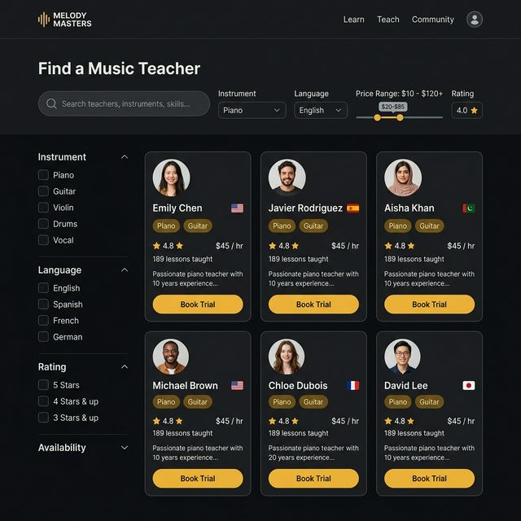
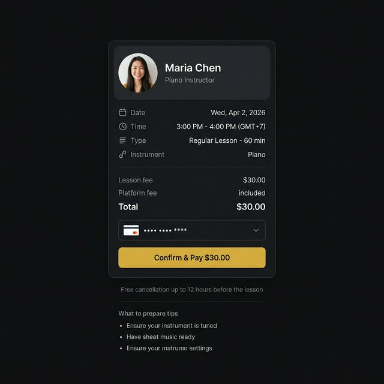
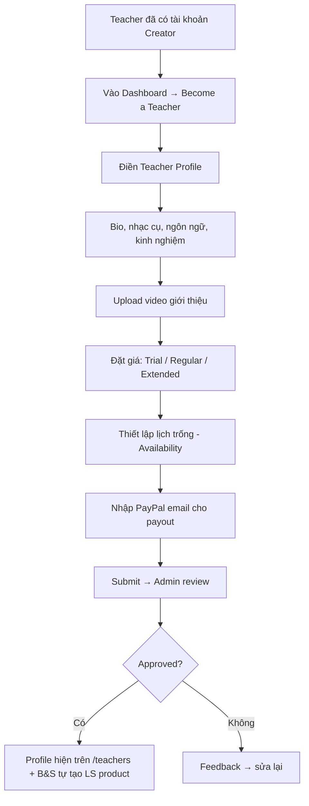
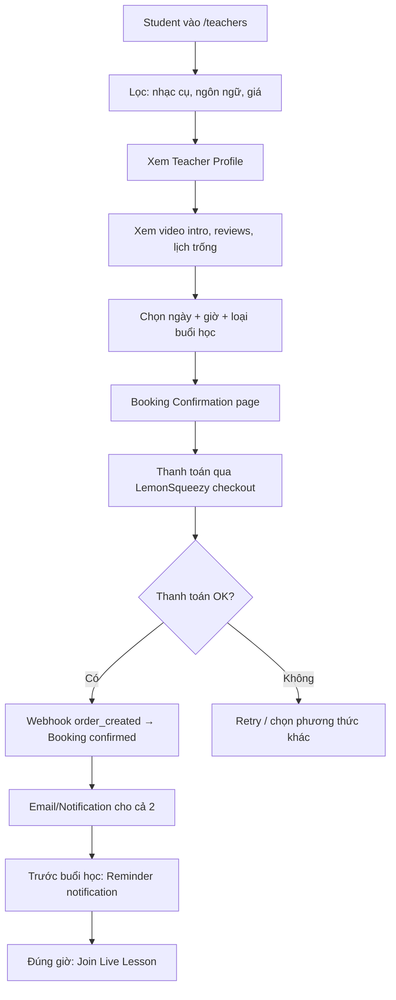
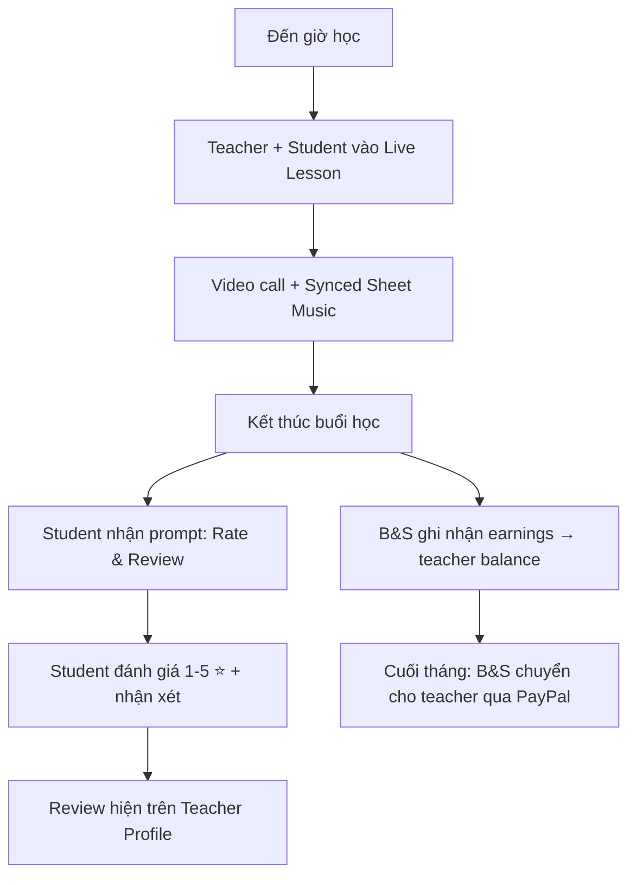
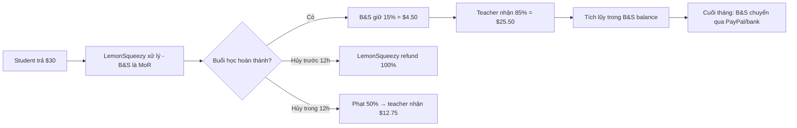

# Marketplace — Thiết kế chi tiết

## 1. Tổng quan

Marketplace biến Backing & Score thành **"italki cho âm nhạc"** — nơi students tìm và đặt lịch học 1:1 với teachers qua Live Lesson (video + synced sheet music).

**Khác biệt với italki:** italki chỉ có video call thuần. B&S có **sheet nhạc tương tác, Wait Mode, accuracy tracking** tích hợp trong cuộc gọi.

```
italki:    Student → Tìm teacher → Đặt lịch → Video call thuần
B&S:       Student → Tìm teacher → Đặt lịch → Video call + Synced Sheet Music + Exercises
```

---

## 2. Giao diện chi tiết

### 2.1 Teacher Discovery (`/teachers`)



```
┌────────────────────────────────────────────────────────────┐
│  Find a Music Teacher                                      │
├────────────────────────────────────────────────────────────┤
│  🔍 [Search teachers, instruments, skills...]              │
│  Instrument: [Piano ▾]  Language: [All ▾]                  │
│  Price: [$10 ─────●──── $120]  Rating: [4.0+ ⭐]          │
├──────────────┬─────────────────────────────────────────────┤
│ Filters      │  ┌─────────┐ ┌─────────┐ ┌─────────┐      │
│              │  │ 👤      │ │ 👤      │ │ 👤      │      │
│ Instrument   │  │ Emily C │ │ Javier  │ │ Aisha K │      │
│ ☐ Piano     │  │ 🇺🇸      │ │ 🇪🇸      │ │ 🇮🇳      │      │
│ ☐ Guitar    │  │ Piano   │ │ Guitar  │ │ Piano   │      │
│ ☐ Violin    │  │ ⭐4.8   │ │ ⭐4.9   │ │ ⭐4.7   │      │
│ ☐ Drums     │  │ $25/hr  │ │ $18/hr  │ │ $30/hr  │      │
│              │  │ 189 les │ │ 342 les │ │ 95 les  │      │
│ Language     │  │[Trial]  │ │[Trial]  │ │[Trial]  │      │
│ ☐ English   │  └─────────┘ └─────────┘ └─────────┘      │
│ ☐ Vietnamese│                                             │
│ ☐ Japanese  │  ┌─────────┐ ┌─────────┐ ┌─────────┐      │
│              │  │ ...     │ │ ...     │ │ ...     │      │
│ Availability │  └─────────┘ └─────────┘ └─────────┘      │
│ ☐ Now       │                                             │
│ ☐ Today     │  [Show more teachers ↓]                     │
│ ☐ This week │                                             │
└──────────────┴─────────────────────────────────────────────┘
```

**Teacher Card hiển thị:**
| Thông tin | Mục đích |
|-----------|----------|
| Avatar + Tên + Quốc kỳ | Nhận diện nhanh |
| Instruments (badges) | Lọc theo nhạc cụ |
| ⭐ Rating (avg) | Social proof |
| Giá/giờ | So sánh giá |
| Số buổi đã dạy | Kinh nghiệm trên platform |
| Bio snippet (1-2 dòng) | Giới thiệu nhanh |
| "Book Trial" button | CTA chính |

**Sorting options:**
- Recommended (default — thuật toán)
- Price: Low to High
- Price: High to Low
- Rating: Highest
- Most lessons taught

### 2.2 Teacher Profile (`/teachers/[id]`)


**Left panel (60%):**
```
┌─────────────────────────────────────────┐
│  👤 Maria Chen ✅ Verified              │
│  📍 Ho Chi Minh City, Vietnam           │
│                                         │
│  Instruments: [Piano] [Music Theory]    │
│  Languages:   English · Vietnamese      │
│  Teaching since: 2018 (8 years)         │
│  Lessons on B&S: 342                    │
│  Response time: < 2 hours               │
│                                         │
│  ── About me ──                         │
│  "I'm a conservatory-trained pianist    │
│   with 8 years of teaching experience.  │
│   I specialize in classical piano and   │
│   music theory for beginners to         │
│   advanced students..."                 │
│                                         │
│  ── My teaching style ──                │
│  "I believe in combining theory with    │
│   practice. Each lesson includes..."    │
│                                         │
│  🎬 [▶ Watch my introduction video]     │
│                                         │
│  ── Lesson types ──                     │
│  • Trial (30 min) — $10                 │
│  • Regular (60 min) — $30              │
│  • Extended (90 min) — $42             │
│                                         │
│  ── Reviews (4.8 ⭐, 128 reviews) ──   │
│  ⭐⭐⭐⭐⭐ Student A: "Amazing         │
│  teacher, patient and clear..."         │
│  ⭐⭐⭐⭐⭐ Student B: "My daughter     │
│  loves learning with Maria..."          │
│  [Show all reviews →]                   │
└─────────────────────────────────────────┘
```

**Right panel (40%) — Booking Card:**
```
┌──────────────────────────────┐
│  $30/hr    Hourly Price      │
│                              │
│  ── Select a date ──         │
│  [◀ April 2026 ▶]           │
│  Su Mo Tu We Th Fr Sa        │
│        1  ② ③  4  5         │
│   6  7  8  ⑨ ⑩ 11 12        │
│  (gold = available)          │
│                              │
│  ── Available times ──       │
│  Wed, Apr 2:                 │
│  [9:00] [10:00] [14:00]     │
│  [●15:00] [16:00]           │
│  (gold = selected)           │
│                              │
│  ── Lesson type ──           │
│  ○ Trial (30 min) — $10     │
│  ● Regular (60 min) — $30   │
│  ○ Extended (90 min) — $42  │
│                              │
│  [Book Lesson — $30]  ← gold│
│                              │
│  📅 Your timezone: GMT+7     │
└──────────────────────────────┘
```

### 2.3 Booking Confirmation (`/teachers/[id]/book`)



### 2.4 Teacher Earnings Dashboard (`/dashboard/earnings`)

```
┌────────────────────────────────────────────────────────────┐
│  💰 Earnings Dashboard                                     │
├────────────────────────────────────────────────────────────┤
│                                                            │
│  ┌──────────┐ ┌──────────┐ ┌──────────┐ ┌──────────┐     │
│  │ $1,240   │ │ $186     │ │ 48       │ │ ⭐ 4.8   │     │
│  │ Tháng này│ │ Chờ rút  │ │ Buổi dạy │ │ Rating   │     │
│  └──────────┘ └──────────┘ └──────────┘ └──────────┘     │
│                                                            │
│  ── Biểu đồ doanh thu (6 tháng) ──                        │
│  $1.5k ┤                          ╭─╮                     │
│  $1.0k ┤              ╭─╮   ╭─╮  │ │                     │
│  $500  ┤    ╭─╮  ╭─╮  │ │   │ │  │ │                     │
│  $0    ┼────┴─┴──┴─┴──┴─┴───┴─┴──┴─┴──                   │
│         Oct  Nov  Dec  Jan  Feb  Mar                       │
│                                                            │
│  ── Buổi dạy sắp tới ──                                   │
│  │ 📅 Apr 2, 15:00 │ Student A │ Piano  │ $30  │         │
│  │ 📅 Apr 3, 10:00 │ Student B │ Theory │ $30  │         │
│  │ 📅 Apr 5, 14:00 │ Student C │ Piano  │ $10* │ *Trial  │
│                                                            │
│  ── Lịch sử giao dịch ──                                  │
│  │ Mar 28 │ Student X │ Completed │ $30 │ +$25.50 net │  │
│  │ Mar 27 │ Student Y │ Completed │ $30 │ +$25.50 net │  │
│  │ Mar 25 │ Student Z │ Cancelled │ $0  │ ---         │  │
│                                                            │
│  [Rút tiền — $186 khả dụng]                               │
└────────────────────────────────────────────────────────────┘
```

---

## 3. Luồng hoạt động chính

### 3.1 Teacher đăng ký dạy trên Marketplace



### 3.2 Student tìm và đặt lịch



### 3.3 Buổi học + Review



### 3.4 Thanh toán & Payout



---

## 4. Teacher Profile — Thiết kế dữ liệu

### 4.1 teacher_profiles Collection

```ts
interface TeacherProfile {
  userId: string;              // → Appwrite account
  displayName: string;
  slug: string;                // URL-friendly: "maria-chen"
  avatarUrl: string;
  coverPhotoUrl?: string;

  // Professional info
  bio: string;                 // max 2000 chars
  teachingStyle: string;       // max 1000 chars
  instruments: string[];       // ["piano", "music-theory"]
  languages: string[];         // ["en", "vi"]
  teachingSince: number;       // year, e.g. 2018

  // Pricing
  trialPriceUsd: number;       // e.g. 10
  trialDurationMin: number;    // e.g. 30
  regularPriceUsd: number;     // e.g. 30
  regularDurationMin: number;  // e.g. 60
  extendedPriceUsd?: number;   // e.g. 42
  extendedDurationMin?: number;// e.g. 90
  currency: string;            // "USD" (default)

  // Media
  videoIntroUrl?: string;      // YouTube/Vimeo embed or Appwrite file

  // Stats (denormalized for fast queries)
  totalLessons: number;
  averageRating: number;
  totalReviews: number;
  responseTimeMinutes: number;

  // Status
  isListed: boolean;           // hiện trên /teachers
  isVerified: boolean;         // admin approved
  timezone: string;            // "Asia/Ho_Chi_Minh"

  // Payment
  lemonSqueezyProductId?: string;  // LS product tạo tự động
  payoutMethod: "paypal" | "bank_transfer";
  payoutEmail?: string;            // PayPal email hoặc bank info
  // Tương lai: stripeConnectId khi migrate sang Stripe Connect

  createdAt: string;
  updatedAt: string;
}
```

### 4.2 availability Collection

```ts
interface Availability {
  teacherId: string;
  dayOfWeek: number;           // 0=Sun, 1=Mon, ..., 6=Sat
  startTime: string;           // "09:00" (teacher's timezone)
  endTime: string;             // "17:00"
  recurring: boolean;          // true = every week
  specificDate?: string;       // "2026-04-02" (for one-off slots)
  isBlocked?: boolean;         // true = explicitly unavailable
}
```

### 4.3 bookings Collection

```ts
interface Booking {
  teacherId: string;
  studentId: string;
  datetime: string;            // ISO 8601: "2026-04-02T15:00:00+07:00"
  durationMin: number;         // 30, 60, or 90
  lessonType: "trial" | "regular" | "extended";

  // Pricing
  priceUsd: number;            // $30
  commissionUsd: number;       // $4.50 (15%)
  teacherEarningUsd: number;   // $25.50

  // Payment (abstracted — hiện dùng LS, tương lai Stripe)
  paymentProviderId: string;     // LemonSqueezy order_id hoặc Stripe PI
  paymentProvider: "lemonsqueezy" | "stripe"; // dễ migrate
  paymentStatus: "pending" | "paid" | "refunded" | "partial_refund";

  // Lesson
  livekitRoomId?: string;      // created when lesson starts
  status: "pending" | "confirmed" | "in_progress" | "completed" | "cancelled" | "no_show";
  cancelledBy?: "teacher" | "student";
  cancelledAt?: string;

  // Post-lesson
  reviewId?: string;

  createdAt: string;
  updatedAt: string;
}
```

### 4.4 reviews Collection

```ts
interface Review {
  bookingId: string;
  studentId: string;
  teacherId: string;
  rating: number;              // 1-5
  content: string;             // max 500 chars
  teacherReply?: string;       // teacher có thể trả lời review
  createdAt: string;
}
```

---

## 5. Component Architecture

```
/teachers (Discovery Page)
├── TeacherSearchBar (search + filters)
├── TeacherFilters (sidebar: instrument, language, price, rating)
├── TeacherGrid
│   └── TeacherCard (avatar, name, instruments, rating, price, CTA)
└── Pagination / Infinite scroll

/teachers/[id] (Profile Page)
├── TeacherHeader (avatar, name, verified, location, stats)
├── TeacherBio (about me, teaching style, video intro)
├── LessonTypes (trial, regular, extended — pricing)
├── BookingCard (sticky sidebar)
│   ├── CalendarPicker (available dates highlighted)
│   ├── TimeSlotSelector (available times)
│   ├── LessonTypeSelector
│   └── BookButton
├── ReviewsList (paginated)
│   └── ReviewCard (rating, student name, content, teacher reply)
└── OtherCourses (if teacher has Classroom courses)

/teachers/[id]/book (Booking Confirmation)
├── BookingSummary (teacher, date, time, type)
├── PriceBreakdown (lesson fee, total)
├── PaymentButton → LemonSqueezy Checkout Overlay
└── (Tương lai: swap sang Stripe Elements khi có US entity)

/dashboard/earnings (Teacher Dashboard)
├── EarningsOverview (cards: this month, pending, lessons, rating)
├── RevenueChart (6-month bar chart)
├── UpcomingLessons (table)
├── TransactionHistory (table)
└── WithdrawButton
```

---

## 6. Tích hợp với hệ thống hiện có

| Module | Tích hợp |
|--------|----------|
| **Live Lesson** | Booking → tạo LiveKit room → cùng UI synced sheet music |
| **Classroom Library** | Teacher có thể dùng exercises từ Library riêng trong buổi 1:1 |
| **User Profile (`/u/[id]`)** | Link sang Teacher Profile nếu user là teacher |
| **Auth (Appwrite)** | Teacher = Creator role + teacher_profiles collection |
| **Payment (LemonSqueezy)** | Tất cả payments qua LemonSqueezy (B&S là MoR). Dùng abstraction layer để tương lai swap sang Stripe Connect |
| **Notifications** | Booking confirmed, reminder trước 1h, review prompt sau buổi |
| **Dashboard** | Thêm tabs: Earnings, Availability, Bookings |

---

## 7. Thuật toán xếp hạng Teacher

**Default ranking trên `/teachers`:**

```ts
function calculateTeacherScore(teacher: TeacherProfile): number {
  const ratingScore = teacher.averageRating * 20;       // max 100
  const volumeScore = Math.min(teacher.totalLessons, 200) / 2; // max 100
  const responseScore = Math.max(0, 100 - teacher.responseTimeMinutes); // max 100
  const completionRate = /* % lessons completed vs cancelled */ 100;
  const recencyBonus = /* active in last 7 days? */ 10;

  return (
    ratingScore * 0.35 +
    volumeScore * 0.25 +
    responseScore * 0.15 +
    completionRate * 0.15 +
    recencyBonus * 0.10
  );
}
```

**New teacher boost:** Teachers mới (< 10 lessons) được boost nhẹ trong 30 ngày đầu để có cơ hội nhận reviews.

---

## 8. Chính sách quan trọng

### 8.1 Hủy & Hoàn tiền

| Thời điểm hủy | Student hủy | Teacher hủy |
|---------------|-------------|-------------|
| > 12h trước | Hoàn 100% | Không phạt, booking hủy |
| 4-12h trước | Hoàn 50% | Cảnh cáo lần 1 |
| < 4h trước | Không hoàn | Cảnh cáo lần 2 |
| No-show | Không hoàn, tính cho teacher | Phạt nặng, có thể suspend |

### 8.2 Teacher Verification

| Bước | Yêu cầu |
|------|---------|
| 1. Profile hoàn chỉnh | Bio, ảnh, ít nhất 1 nhạc cụ, video intro |
| 2. ID verification | Upload CMND/Passport (tương lai) |
| 3. Admin review | Kiểm tra profile + video intro |
| 4. Approved → Listed | Hiện trên /teachers |

### 8.3 Bảo vệ Teacher & Student

| Vấn đề | Giải pháp |
|--------|-----------|
| Fake reviews | Chỉ review sau buổi học completed |
| Teacher dạy ngoài platform | Phát hiện qua share link, cảnh cáo |
| Student quấy rối | Report → admin xem xét → ban |
| Tranh chấp thanh toán | Dispute resolution qua admin |

---

## 9. Responsive Design

### Desktop (>1024px)
```
/teachers:    [Sidebar filters] [3-column teacher grid]
/teachers/id: [Teacher info 60%] [Booking card 40%]
```

### Tablet (768-1024px)
```
/teachers:    [Top filters bar] [2-column grid]
/teachers/id: [Teacher info full] [Booking card below]
```

### Mobile (<768px)
```
/teachers:    [Filter button → sheet] [1-column cards]
/teachers/id: [Teacher info full] [Sticky "Book" bottom bar]
```

---

## 10. Giai đoạn triển khai

### Phase 1 — Teacher Onboarding (1.5 tuần)
- [ ] `teacher_profiles` + `availability` collections
- [ ] Teacher Profile editor trong Dashboard
- [ ] Video intro upload
- [ ] Availability calendar UI
- [ ] Admin approval workflow

### Phase 2 — Discovery & Booking (2 tuần)
- [ ] `/teachers` — search + filters + teacher grid
- [ ] `/teachers/[id]` — profile page + booking card
- [ ] Calendar picker + time slot selector
- [ ] `/teachers/[id]/book` — confirmation + LemonSqueezy checkout
- [ ] Payment abstraction layer (`IPaymentProvider`)
- [ ] `bookings` collection + status management
- [ ] Email notifications (confirmation, reminder)

### Phase 3 — Live Lesson Integration (0.5 tuần)
- [ ] Booking → auto-create LiveKit room khi đến giờ
- [ ] "Join Lesson" button cho cả teacher + student
- [ ] Tích hợp Classroom Library exercises vào buổi 1:1

### Phase 4 — Reviews & Earnings (1 tuần)
- [ ] Post-lesson review prompt
- [ ] Reviews hiển thị trên teacher profile
- [ ] Teacher reply to review
- [ ] Earnings dashboard (stats, chart, transactions)
- [ ] Teacher payout qua PayPal / bank transfer

> **Tương lai (khi có US entity):** Swap `LemonSqueezyProvider` → `StripeConnectProvider`, teacher onboard Stripe trực tiếp, payout tự động.

### Phase 5 — Polish (1 tuần)
- [ ] Teacher ranking algorithm
- [ ] SEO: `/teachers/maria-chen` với structured data
- [ ] Mobile responsive
- [ ] "Instant Book" (teacher online, sẵn sàng ngay)
- [ ] "Favorite teachers" (student bookmark)
- [ ] Trial → Regular conversion tracking

**Tổng estimate: ~6 tuần**
