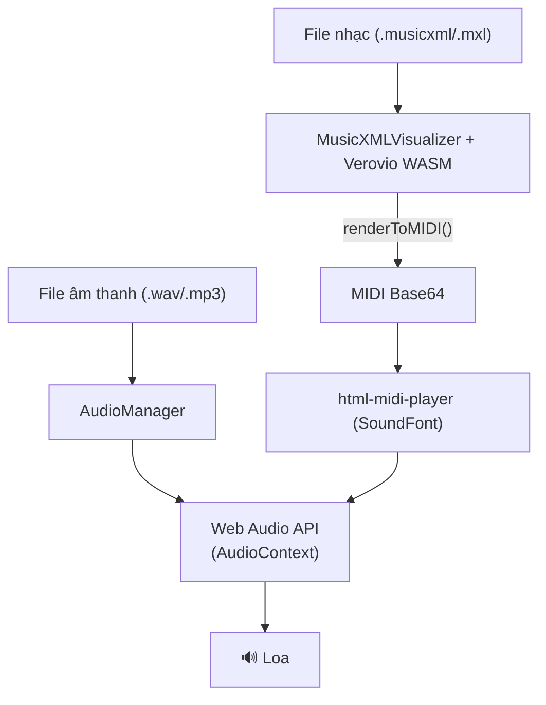

# 🎵 Kiến thức MIDI & Audio trong Backing & Score

Tài liệu này giải thích các khái niệm kỹ thuật về xử lý âm thanh và MIDI được sử dụng trong dự án, viết cho người không có nhiều kinh nghiệm chuyên sâu về lĩnh vực này.

---

## 1. Tổng quan kiến trúc Audio



Dự án kết hợp **hai nguồn âm thanh** phát song song:
- **Audio Stems**: Các file nhạc thực (drums, guitar, piano…) → chạy qua [AudioManager](file:///Users/jefftrung/projects/paperclip/lotusa/projects/backing-and-score/src/lib/audio/AudioManager.ts#28-584)
- **Score Synth**: MIDI được tổng hợp từ file nhạc MusicXML → chạy qua `html-midi-player`

---

## 2. Web Audio API và AudioContext

### AudioContext là gì?
`AudioContext` là "bộ não" xử lý âm thanh của trình duyệt. Mọi thao tác phát nhạc đều phải thông qua nó.

```
AudioContext
  └── AudioNode (nguồn âm thanh)
       └── GainNode (điều chỉnh âm lượng)
            └── StereoPannerNode (điều chỉnh pan trái/phải)
                 └── AudioContext.destination (loa)
```

### Tại sao iOS cần unlock?
iOS/Safari **không cho phép** phát âm thanh nếu chưa có tương tác của người dùng (bấm nút, chạm màn hình). Khi `AudioContext` ở trạng thái `"suspended"`, ta phải gọi `context.resume()` **bên trong** một sự kiện click. Dự án xử lý điều này trong [unlockiOSAudio()](file:///Users/jefftrung/projects/paperclip/lotusa/projects/backing-and-score/src/lib/audio/AudioManager.ts#79-100):

```ts
// Phải được gọi đồng bộ trong onClick handler
await context.resume();
// Phát 1 frame im lặng để kích hoạt hardware pipeline của iOS
const buffer = context.createBuffer(1, 1, 22050);
const source = context.createBufferSource();
source.connect(context.destination);
source.start(0);
```

---

## 3. AudioBuffer — Bộ nhớ âm thanh

`AudioBuffer` là **bộ đệm** chứa toàn bộ dữ liệu âm thanh đã được giải mã trong RAM.

**Quy trình load một file nhạc:**
```
URL (Appwrite) → fetch → ArrayBuffer (bytes thô) → decodeAudioData → AudioBuffer (PCM float)
```

| Khái niệm | Ý nghĩa |
|---|---|
| `ArrayBuffer` | Mảng byte thô của file nhạc (chưa dùng được) |
| `AudioBuffer` | Dữ liệu âm thanh đã giải mã (PCM float), có thể phát ngay |
| `numberOfChannels` | Số kênh: 1 = mono, 2 = stereo |
| `sampleRate` | Số mẫu mỗi giây (thường 44100 Hz) |
| `duration` | Tổng thời gian tính bằng giây |

**Đồng bộ nhiều track:** các track được `start()` tại cùng một `syncStartTime` (thời điểm trong tương lai theo `AudioContext.currentTime`), đảm bảo tất cả bắt đầu đúng một lúc.

---

## 4. Time-stretching & Pitch Shifting — SoundTouch

### Vấn đề
Nếu hạ tốc độ phát từ 1x xuống 0.5x bằng `source.playbackRate = 0.5`, giọng ca sẽ bị **xuống tông** (như băng cassette bị kéo chậm).

### Giải pháp: SoundTouch (WSOLA Algorithm)
**SoundTouch** là thư viện xử lý âm thanh dùng thuật toán **WSOLA** (Waveform Similarity Overlap-Add):
- **Thay đổi tốc độ** mà **không thay đổi pitch** (Time-stretching)
- **Thay đổi pitch** mà **không thay đổi tốc độ** (Pitch-shifting)

Trong dự án, SoundTouch chạy như một **AudioWorklet** (một Web Worker chuyên dụng cho audio):

```ts
await context.audioWorklet.addModule('/soundtouch-processor.js');
const stNode = new SoundTouchNode(context);

stNode.playbackRate.value = 0.75;  // Chậm 75%, không thay pitch
stNode.pitch.value = Math.pow(2, semitones / 12); // Transpose pitch
```

**Công thức chuyển đổi semitone → pitch ratio:**
```
pitchRatio = 2^(semitones / 12)
```
- Tăng 1 octave (+12 semitones) → ratio = 2.0
- Giảm nửa cung (-1 semitone) → ratio ≈ 0.944

> [!NOTE]
> Nếu SoundTouch load thất bại (ví dụ trên một số trình duyệt cũ), hệ thống tự động fallback về `source.playbackRate` (có biến pitch).

---

## 5. Audio Graph (Node Graph)

Mỗi track trong [AudioManager](file:///Users/jefftrung/projects/paperclip/lotusa/projects/backing-and-score/src/lib/audio/AudioManager.ts#28-584) có một **chuỗi node xử lý**:

```
AudioBufferSourceNode
       ↓
[SoundTouchNode] ← tùy chọn (time-stretch + pitch)
       ↓
StereoPannerNode ← điều chỉnh Pan (-1.0 trái → +1.0 phải)
       ↓
GainNode ← điều chỉnh Volume (0.0 → 1.0)
       ↓
AudioContext.destination (loa)
```

**Solo/Mute logic:** khi có track được Solo, tất cả track khác được set `gainNode.gain.value = 0` (mute hoàn toàn ở cấp độ gain, không cần disconnect).

---

## 6. A-B Looping

Tính năng lặp lại một đoạn nhạc (ví dụ từ ô nhịp 5 đến 12) được implement bằng `setInterval` polling mỗi **30ms**:

```ts
// Nếu playhead vượt qua loopEnd → seek về loopStart
if (currentPositionMs >= loopEnd - 40) {
    seek(loopStart);
}
```

**Tại sao dùng 40ms lookahead?** Để tránh hiện tượng nghe thấy tiếng "click" khi cắt đột ngột ở đúng ranh giới, ta seek sớm hơn một chút (40ms) để có thời gian buffer.

---

## 7. MusicXML và Verovio

### MusicXML là gì?
**MusicXML** là định dạng file XML tiêu chuẩn để lưu trữ nhạc ký tự (sheet music). Nó mô tả từng nốt nhạc, tempo, thời gian, nhịp điệu, v.v. Các phần mềm như Sibelius, Finale, MuseScore đều xuất được MusicXML.

**File .mxl**: là MusicXML bị nén bằng ZIP. Khi upload, dự án tự giải nén bằng **JSZip** trước khi xử lý.

### Verovio là gì?
**Verovio** là thư viện C++ được biên dịch sang **WebAssembly (WASM)** dùng để:
1. Render MusicXML thành **SVG** (hình ảnh khuông nhạc)
2. Export MusicXML thành **MIDI**

Verovio chạy trong **Web Worker** (luồng riêng biệt) để không làm treo giao diện:

```
Main Thread (UI) ←→ VerovioWorkerProxy ←→ Web Worker (Verovio WASM)
```

**Quy trình render:**
```
MusicXML text → setOptions(width, scale) → loadData() → renderToSVG() → SVG string
```

**Quy trình tạo MIDI:**
```
MusicXML text → loadData() → renderToMIDI() → Base64 MIDI string
```

---

## 8. Các lỗi Sibelius và cách fix

File MusicXML xuất từ **Sibelius** thường chứa một số lỗi. Dự án tự fix trước khi đưa vào Verovio:

| Lỗi | Nguyên nhân | Cách fix |
|---|---|---|
| Whole Rest sai | Sibelius xuất whole rest trong ô nhịp 3/4 với `<type>whole</type>` | Thêm attribute `measure="yes"` vào tag `<rest>` |
| Pedal tag loop | Tag `<pedal>` gây cascade VLV timestamp | Xóa toàn bộ `<direction>` chứa `<pedal>` |
| Unclosed ties | Nốt nhạc có `<tie type="start">` nhưng không có `<tie type="stop">` tương ứng | Duyệt và xóa các tie không có cặp |
| Accidental sai | MIDI engine bỏ qua dấu thăng/giáng ngầm định | Chèn thêm tag `<accidental>` tường minh |

---

## 9. MIDI và SoundFont

### MIDI là gì?
**MIDI** (Musical Instrument Digital Interface) **không phải là âm thanh** — nó là tập lệnh ra lệnh cho nhạc cụ:

```
Note On  (channel=0, pitch=60, velocity=80) → "Phát nốt C4 với độ mạnh 80"
Note Off (channel=0, pitch=60)              → "Dừng nốt C4"
```

### SoundFont là gì?
**SoundFont** là ngân hàng âm thanh nhạc cụ thực (được ghi âm). Khi MIDI gửi lệnh "phát nốt Piano C4", SoundFont cung cấp mẫu âm thanh piano thực tế.

Dự án dùng **html-midi-player** với SoundFont của Google Magenta:
```
sound-font="https://storage.googleapis.com/magentadata/js/soundfonts/sgm_plus"
```

### Luồng MIDI Playback
```
MusicXML → Verovio → Base64 MIDI → [Time-stretch với Tone.js] → html-midi-player → SoundFont → Audio
```

**MIDI Time-stretching:** MIDI không có khái niệm "tốc độ". Để slow down MIDI, dự án dùng **Tone.js** để rebuild lại file MIDI với các timestamp đã scale theo `playbackRate`, tạo ra `stretchedMidiBase64`.

---

## 10. Timemap — Cầu nối giữa Audio và Sheet Music

**Timemap** là mảng ánh xạ giữa **thời gian audio (ms)** và **số ô nhịp (measure)**:

```json
[
  { "measure": 1, "timeMs": 0 },
  { "measure": 2, "timeMs": 2000 },
  { "measure": 3, "timeMs": 4000 }
]
```

**Tại sao cần Timemap?**
- Audio stem và sheet music không tự biết nhau ở vị trí nào.
- Timemap là "bản đồ" do người dùng (hoặc tự động) tạo ra để nói: "Khi audio phát đến 2000ms, sheet music đang ở ô nhịp 2".

**Cách tạo Timemap:** Người dùng bật **Sync Mode** → bấm phím Space vào đúng nhịp 1 của từng ô nhịp khi nhạc đang chạy → hệ thống ghi lại timestamp tương ứng.

**Playhead interpolation:** Giữa hai điểm trong timemap, vị trí playhead được nội suy tuyến tính (linear interpolation) để chạy mượt:
```
progress = (currentTimeMs - measureStart) / (nextMeasureStart - measureStart)
playheadX = measureLeft + (measureWidth * progress)
```

---

## 11. Wait Mode — Chế độ luyện tập

Wait Mode là tính năng **tạm dừng audio** và **đợi người dùng chơi đúng nốt** trước khi tiếp tục.

**Luồng hoạt động:**
```
1. Audio đang chạy bình thường
2. Tới nốt "practice" → Audio PAUSE
3. Verovio.getElementsAtTime(posMs) → lấy ID các nốt cần chơi
4. Highlight màu đỏ (.wait-mode-missed) → "Đây là nốt bạn cần chơi"
5. Pitch Detection (Web Audio API AnalyserNode) → phân tích tần số từ microphone
6. Người dùng chơi đúng nốt → Audio RESUME
7. Nốt vừa chơi highlight xanh (.note-playing-correct)
```

---

## 12. Metronome Engine

Metronome được implement bằng **Web Audio API Oscillator**, không phải bằng `setInterval` thông thường. Lý do:

> [!IMPORTANT]
> `setTimeout` và `setInterval` bị JavaScript giới hạn độ chính xác (~4ms sai lệch) và bị trình duyệt throttle khi tab ở background. Web Audio API scheduling chính xác đến **sample level** (~0.02ms).

**Cách hoạt động:**
```ts
// Schedule tiếng "tick" vào thời điểm tương lai chính xác
const osc = context.createOscillator();
osc.frequency.value = 880; // Hz
osc.connect(context.destination);
osc.start(nextTickTime);
osc.stop(nextTickTime + 0.05); // Chỉ kêu 50ms
```

---

## 13. DAWPayload — Cấu trúc dữ liệu Project

Toàn bộ thông tin của một project được lưu dưới dạng JSON trong Appwrite:

```json
{
  "version": 2,
  "type": "multi-stems",
  "metadata": {
    "tempo": 120,
    "timeSignature": "4/4",
    "keySignature": "C Maj",
    "syncToTimemap": true,
    "scoreSynthMuted": false,
    "scoreSynthVolume": 1.0,
    "scoreSynthOffsetMs": 0
  },
  "audioTracks": [
    {
      "id": "uuid-1",
      "name": "Drums",
      "fileId": "appwrite-file-id",
      "volume": 0.8,
      "muted": false,
      "offsetMs": 200
    }
  ],
  "notationData": {
    "type": "music-xml",
    "fileId": "appwrite-file-id-of-musicxml",
    "timemap": [
      { "measure": 1, "timeMs": 0 },
      { "measure": 2, "timeMs": 2000 }
    ]
  }
}
```

| Field | Ý nghĩa |
|---|---|
| `audioTracks` | Danh sách các stem âm thanh (drums, guitar, v.v.) |
| `notationData.fileId` | File MusicXML trên Appwrite |
| `notationData.timemap` | Bản đồ thời gian audio ↔ ô nhịp |
| `scoreSynthOffsetMs` | Độ trễ của MIDI so với Audio (fine-tune đồng bộ) |
| `offsetMs` (track) | Độ trễ của một stem cụ thể so với các stem khác |

---

## 14. Tóm tắt các thư viện chính

| Thư viện | Vai trò |
|---|---|
| **Web Audio API** | Engine âm thanh gốc của trình duyệt |
| **SoundTouchJS** | Time-stretching & Pitch-shifting không thay tông |
| **Verovio WASM** | Render MusicXML → SVG + MIDI |
| **html-midi-player** | Phát MIDI bằng SoundFont |
| **Tone.js** | Xử lý MIDI time-stretching |
| **JSZip** | Giải nén file .mxl |
| **AudioWorklet** | Chạy SoundTouch trong luồng audio riêng |
