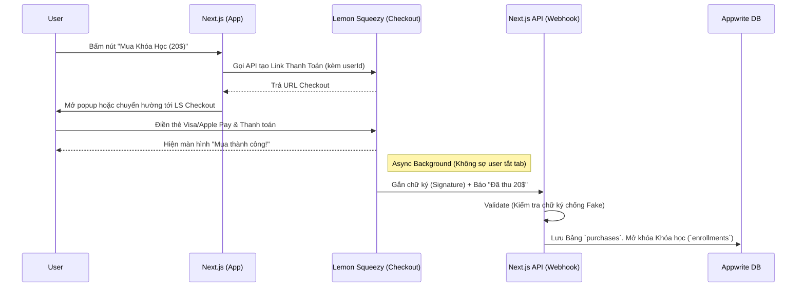

# Chiến Lược Thanh Toán (Monetization Strategy): Backing & Score

Để biến **Backing & Score** từ một nền tảng miễn phí thành cỗ máy in tiền (bán Khóa Học, Bán Sheet Music PDF), bạn cần một hệ thống thanh toán tự động, mượt mà và đặc biệt là **hợp pháp về mặt thuế** trên toàn cầu (đối với cá nhân ở Việt Nam).

Dưới đây là bức tranh toàn cảnh về cách hệ thống Thanh toán sẽ hoạt động.

---

## 1. Bài toán: Lemon Squeezy vs Stripe

Rất nhiều Founder nhầm lẫn giữa hai khái niệm **Payment Processor** (Cổng thanh toán) và **Merchant of Record (MoR)**. 

| Tiêu Chí | Stripe (Cổng Thanh Toán) | Lemon Squeezy / Paddle (MoR) |
| :--- | :--- | :--- |
| **Bản chất** | Chỉ đơn thuần cà thẻ khách hàng và chuyển tiền cho bạn. | Đứng ra **mua lại** sản phẩm của bạn, rồi **bán cho khách**. Trên hóa đơn của khách sẽ ghi chữ "Lemon Squeezy". |
| **Luật Thuế (VAT/Sales Tax)** | Khách ở châu Âu, Mỹ, Úc mua hàng? **BẠN** phải tự tính toán thuế VAT của quốc gia đó, tự gom tiền thuế đi đóng cho chính phủ nước họ. Rất dễ dính án phạt pháp lý nếu bán Global. | **Lemon Squeezy tự động lo 100%**. Họ tính đúng thuế từng bang, từng quốc gia và tự đi đóng thay bạn. |
| **Đăng ký ở Việt Nam** | Khá gắt gao. Stripe chưa support chính thức ở VN (phải lách qua Stripe Atlas/Singapore). Khó mở cổng Apple Pay/Google Pay quốc tế nếu không có doanh nghiệp hợp lệ. | Dễ thở hơn nhiều. Hỗ trợ Payout (Rút tiền) thẳng về tài khoản cá nhân qua Payoneer hoặc ngách ngân hàng nội địa. (Thường payout ngày 15 và 30 hàng tháng). |
| **Hỗ trợ Affiliate/Mã giảm giá** | Cần code tay hoặc mua app bên thứ 3. | Tích hợp sẵn hệ thống mồi nhử Affiliate, báo cáo doanh thu đẹp xuất sắc ngay trong Dashboard. |
| **Phí giao dịch** | Thấp hơn (~$0.30 + 2.9%). | Cao hơn một chút (~5% + 50 cents) vì họ bao thầu pháp lý và thuế. |

> [!TIP]
> **Khuyến nghị cho Backing & Score:** Sử dụng **Lemon Squeezy**. Đối với các sản phẩm dạng số (Digital Product) như Sheet Music hay Khóa học online, việc rũ bỏ được gánh nặng pháp lý/thuế quốc tế có giá trị hơn rất nhiều so với 2% chênh lệch phí giao dịch.

---

## 2. Kiến Trúc Tích Hợp (The Architecture)

Hệ thống thanh toán không thể tin tưởng phía Client (Trình duyệt của user) vì rất dễ bị hack. Luồng giao dịch phải đi theo hình tam giác: **Trình duyệt (Next.js)** -> **Lemon Squeezy Checkout** -> **Server của bạn (Appwrite/Next.js API Webhook)**.

---

## 3. Bản Đồ Kỹ Thuật (Appwrite Database Schema)

Để thực thi, chúng ta sẽ cần cập nhật hệ thống Database trên Appwrite:

### 👉 Bảng 1: `products` (Có thể quản lý ngay trên Lemon Squeezy, không cần Appwrite)
Thực ra, bạn nên vào Dashboard của Lemon Squeezy, tạo các sản phẩm (VD: "Khóa học Guitar Cơ Bản" với giá 20$). Lemon Squeezy sẽ ném lại cho bạn một cái `Variant ID`. 
Bạn chỉ cần lấy `Variant ID` đó gán vào Appwrite (Bảng `courses.variantId`).

### 👉 Bảng 2: `purchases` (Lịch sử thanh toán - Tạo mới)
Mỗi khi Lemon Squeezy báo có tiền về, mình phải lưu lại biên lai để tránh mở khóa nhầm và làm cơ sở giải quyết tranh chấp.
- `orderId`: String (ID đơn hàng từ LS, VD: `123456`)
- `userId`: String (Ai đã mua)
- `targetType`: String (`course`, `sheet_music`)
- `targetId`: String (ID của khóa học hoặc bài Sheet)
- `priceUsd`: Number (Giá tiền mua)
- `status`: String (`paid`, `refunded`, `failed`)

### 👉 Bảng 3: `enrollments` / `unlocks` (Mở khóa nội dung)
Chúng ta đã có sẵn `enrollments` cho Courses. Nếu user mua Sheet Music, có thể ta cần thêm cờ `ownerIds` hoặc tương tự.

---

## 4. Những Chức Năng Chúng Ta Sẽ Cần Xây Dựng:
1. **LS API Client**: Một module nhỏ trên Next.js Server (nằm trong thư mục `/src/lib/lemon-squeezy`) dùng `fetch` chứa API Key để nặn ra URL Thanh toán Checkout. Tức là bấm Mua -> Hiện màn ảnh cà thẻ.
2. **Webhook Endpoint Handler**: Một route API `app/api/webhooks/lemon/route.ts` để đón sóng từ Lemon Squeezy quăng về khi user cà thẻ thành công. Tại đây chứa thuật toán Check mã HMAC Crypto Hash chống hacker Fake bill giả. Hợp lệ thì gọi Appwrite DB để cấp quyền truy cập content (Enrollment).
3. **UI Mua Hàng**: Biến tấu lại nút bấm Mua khóa học. State "Đang lấy link..." -> "Mở Tab Pay..." -> Polling check nếu database đã nảy số `enrollments` thì tự động đổi UI sang nút "Bắt đầu học ngay!".

## 5. Tạm Kết

Phương án trên là an toàn, chuyên nghiệp và tiệm cận với mọi sản phẩm SaaS triệu đô khác ngoài thị trường. Việc bạn thu tiền của Tây, tiền chảy về Lemon Squeezy, sau đó Lemon Squeezy bắn tiền về Payoneer/Ngân Hàng của bạn là một luồng thu nhập vô cùng sạch sẽ và rảnh rang đầu óc để bạn cắm đầu vào việc Mix nhạc! 🎸
