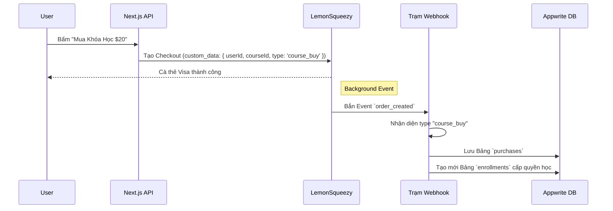

# Chiến Lược Thanh Toán & Doanh Thu: Quản lý Subscription và Chợ Sáng Tạo (Marketplace)

Hệ thống của **Backing & Score** hiện tại đã làm rất tốt việc thiết lập nền móng thanh toán, tích hợp trơn tru **Lemon Squeezy** để xử lý các gói *Trả phí định kỳ (Subscriptions)*. Tuy nhiên, hành trình vươn tới việc biến nền tảng thành một "Sân chơi sinh lời cho Creator" đòi hỏi thêm một bước tiến quan trọng.

Dưới đây là một chiến lược toàn diện được vạch ra để vận hành song song cả hai nguồn thu:

---

## 1. Hệ Sinh Thái Hiện Tại (Phase 1: Platform Subscriptions)

Bạn đã xây dựng thành công 80% khối lượng công việc khó nhất cho việc thu tiền:
* **SDK Lemon Squeezy (`src/lib/lemonsqueezy/client.ts`)**: Đã có hàm tạo Checkout Session nhanh gọn.
* **Webhook Handler (`src/app/api/webhooks/lemonsqueezy/route.ts`)**: Đã hoạt động mượt mà, chuyên đi gom các log liên quan đến `subscription_*` (tạo mới, hết hạn, hủy).
* **Appwrite (`src/lib/appwrite/subscriptions.ts`)**: Bảng `subscriptions` ghi nhận chuẩn xác trạng thái thanh toán hàng tháng của người dùng.

> [!TIP]
> **Tài sản cực lớn**: Vì cấu trúc bảo mật HMAC Webhook và Node-Appwrite Server SDK đã có sẵn, chúng ta có thể tận dụng lại hạ tầng này để xây dựng Phase 2 trong chớp mắt mà không cần đập đi xây lại.

---

## 2. Thách Thức Mới (Phase 2: Creator Marketplace)

Gói trả phí định kỳ (Subscription) ném tiền thẳng vào túi của Platform (Bạn). Nhưng nếu một **Giáo viên Guitar** tạo ra *Khóa học "Solo cơ bản"* và bán với giá **$20**, thì luồng tiền phải đi như thế nào?

Lemon Squeezy mang bản chất là **Merchant of Record (MoR)**, họ chỉ trả tiền duy nhất cho chủ cửa hàng là bạn. Họ không có tính năng Split Payment (Cắt phế tiền và chia thẳng cho 2 tài khoản ngân hàng lúc user đang quẹt thẻ như Stripe Connect). 

### Giải pháp Vàng: Biến Creator Thành Affiliate

Lemon Squeezy cung cấp hệ thống Affiliate (Tiếp thị liên kết) cực kỳ mạnh mẽ. Nhờ vậy, ta có thể đánh lừa hệ thống để làm **Marketplace Payouts** tự động:
1. Bạn đóng vai chủ sản phẩm Khóa Học đó (Cửa hàng Bán).
2. Khi Creator đăng bán Khóa Học, Server của chúng ta tự động gọi API đẩy Creator đó thành một `Affiliate` của sản phẩm trên Lemon Squeezy với mức hoa hồng **Hoa hồng: 80%**.
3. Khách quẹt thẻ $20. Lemon Squeezy tự động cắt:
   - 20% cho Bạn (Doanh thu nền tảng).
   - 80% cho Giáo Viên (Tự động cộng vào ví LS Affiliate của họ và bank về Payoneer ngày 15, 30).
4. **Kết quả**: Lemon Squeezy làm hộ luôn phần kế toán mệt mỏi nhất cho toàn bộ hệ thống bán lẻ của Multi-Vendor!

---

## 3. Kiến Trúc Mở Rộng: Tích Hợp Đơn Mua Lẻ (One-time Purhases)

Hiện tại Webhook của chúng ta đang "bỏ lơ" các đơn mua lẻ. Để hỗ trợ bán các sản phẩm kỹ thuật số một lần (Courses, Sheet Music), cần bổ sung:

---

## 4. Bảng Kế Hoạch Triển Khai Tiếp Theo (Roadmap)

Dưới đây là các Task cần thực hiện để biến Backing & Score thực sự trở thành cỗ máy bán Content:

### 4.1 Bổ sung Hạ Tầng Appwrite (Appwrite DB)
- Bổ sung bảng Bảng **`purchases`**: Mục đích lưu lịch sử Hóa Đơn Mua Hàng Lẻ (Ai mua, mua giờ nào, giá bao nhiêu).
- Tận dụng tiếp bảng **`enrollments`** (đang có sẵn) để mở khóa Access Khóa học khi thanh toán về.

### 4.2 Nâng Cấp Webhook Handler
- Bổ sung vào `src/app/api/webhooks/lemonsqueezy/route.ts` một nhánh `if (eventName === 'order_created')`. 
- Sửa lại hàm Validate để khi LS quăng bill về, nếu là Gói Subscription thì update Subscription, nếu là Bill Lẻ thì gọi hàm đẩy vào `purchases`.

### 4.3 Quản Lý Sản Phẩm Đồng Bộ (Sync Products API)
- Tạo thêm form trên Next.js cho Admin (hoặc Creator) nhập Giá Tiền.
- Khi nhập Giá Tiền, gọi `Lemon Squeezy API` tạo một `Product` mới trên cửa hàng tự động (sử dụng LS Store API) thay vì phải vào Dashboard LS tạo bằng tay.
- (Tùy chọn) Viết code cho Lemon Squeezy Affiliate API để tự chia "% Doanh thu" cho Creator tải lên nếu có.

## Lời Kết

Hệ thống của chúng ta đang sở hữu một cấu trúc thanh toán cực kỳ tinh gọn. Chỉ cần mở thêm trạm đón **"Đơn hàng Lẻ (Order Created)"** vào hệ thống Webhook, ta có thể xây dựng tính năng Bán Khoá Học, Bán PDF, Bán Backing Track một cách thần tốc! 🍋
