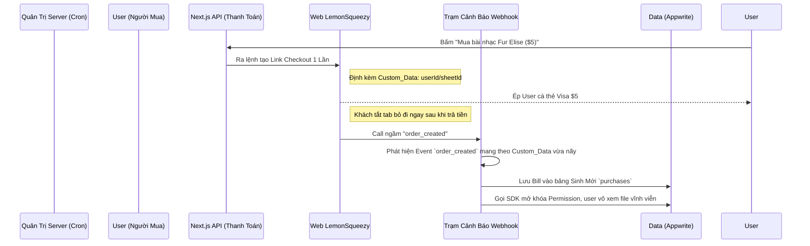

# Chiến Lược Thanh Toán & Doanh Thu: Quản lý Subscription và Chợ Sáng Tạo (Marketplace)

Hệ thống của **Backing & Score** hiện tại đã làm rất tốt việc thiết lập nền móng thanh toán, tích hợp trơn tru **Lemon Squeezy** để xử lý các gói *Trả phí định kỳ (Subscriptions)*. Tuy nhiên, hành trình vươn tới việc biến nền tảng thành một "Sân chơi sinh lời cho Creator" đòi hỏi thêm một bước tiến quan trọng.

Dưới đây là một chiến lược toàn diện được vạch ra để vận hành song song cả hai nguồn thu. Nhưng trước tiên, hãy cùng làm rõ các thuật ngữ kinh doanh quan trọng!

---

## 📖 Từ Điển Kinh Doanh Dành Cho Founder "Ngoại Đạo"

Nếu bạn là Lập trình viên hoặc Nhạc sĩ, những từ lóng dưới đây có thể nghe rất xa lạ. Đừng lo, tôi đã "dịch" chúng sang tiếng Việt cực kỳ dân dã:

1. **Monetization (Kiếm tiền/Thương mại hóa)**: Biến một lượng lớn User đăng ký miễn phí thành tiền mặt thật sự thông qua bán sản phẩm hoặc gói VIP.
   
2. **Subscription (Thuê bao / Thu phí định kỳ)**: Giống như tiền điện, nước hay Netflix. Tức là tháng nào (hoặc năm nào) khách cũng bị trừ tiền tư động để hưởng đặc quyền. (Hệ thống của bạn *đã có* tính năng này).

3. **One-time Purchase (Mua đứt / Giao dịch một lần)**: Khách trả $10 để mua 1 bản Sheet Music PDF. Trả xong là lấy file về học, không phải đóng thêm sau này. (Đây là tính năng chúng ta *sắp làm*).

4. **Multi-Vendor Marketplace (Mô hình Chợ nhiều người bán)**: Tương tự như Shopee, eBay, Udemy. Trong app của bạn, nhiều Thầy Giáo (Creator) có thể tự up Khóa học lên bán độc lập. Bạn (Chủ nền tảng) đứng giữa để... thu "tiền xâu" (Platform Fee - Thường là 20%-30%).

5. **Split Payment / Payouts (Tách tiền / Chi trả tự động)**: Khách cà thẻ $10 xong, trong vòng chưa tới 1 giây, tiền phải lập tức bị xẻ ra: $2 vô mồm Chủ Nền Tảng, $8 vô túi Thầy Giáo. Nghe thì dễ nhưng code cực kỳ mệt mỏi!

6. **Payment Gateway (Cổng Thanh Toán - VD: Stripe, VNPay)**: Đơn thuần chỉ là một cái *Máy Quẹt Thẻ* online. Khách quẹt thẻ, máy báo "Ting!" và rót 100% tiền vào Ví Ngân Hàng của bạn. Nó KHÔNG MIGHT quan tâm tới luật pháp hay thuế má ở bên Mỹ, Âu. Nếu bạn xài nó bán Global, bạn phải TỰ TÍNH VAT của 50 tiểu bang Mỹ và gửi tiền thuế về kho bạc của họ. (Bạn không làm? Bạn sẽ bị bắt/phạt tiền tỉ).

7. **Merchant of Record / MoR (Người Bán Hợp Pháp - VD: Lemon Squeezy, Apple App Store)**: Giống như một cái siêu thị nhận Ký Gửi hàng. Về mặt luật pháp, Lemon Squeezy ĐÃ MUA lại file PDF của bạn, rồi TỰ ĐEO BẢNG MẶT MÌNH đi bán cho ông Tây. 
   - **Lợi ích**: Ông Tây mua hàng? Hóa đơn ghi "Người bán: Lemon Squeezy". Chính phủ Mỹ đòi thuế? Lemon Squeezy sẽ lấy tiền túi ra đóng thuế. Nguy cơ bị kiện cáo/hoàn tiền lừa đảo? Lemon Squeezy cản mũi chịu đòn hết.
   - Bạn an tâm ngủ ngon và nhận tiền sạch vào ví của mình trừ đi ~5% phí dịch vụ. Quá đáng đồng tiền bát gạo cho các Founder độc lập!

8. **Affiliate (Tiếp thị liên kết)**: Việc bạn cho hoa hồng ai đó (chẳng hạn 20%) khi họ giới thiệu link bán hàng mồi chài khách mua sản phẩm của bạn. 
   - Điểm độc đáo trong chiến lược của mình: Chúng ta sẽ cấu hình **Cho Thầy Giáo làm Affiliate của chính sản phẩm Khóa Học do họ làm ra**, và cho họ ăn hoa hồng 80%! Bằng cách này, Khách mua phát -> Lemon Squeezy tự động lấy $8 quăng vào ví ông Thầy (tính theo Affiliate), $2 quăng vào ví Bạn (Chủ Khoá học gốc). Xong bài toán **Split Payment** Multi-Vendor mà không phải viết 1 dòng code chia chác nào!

9. **Webhook (Còi báo động)**: Lúc Khách cà thẻ ở giao diện Lemon Squeezy trên Cloud, làm sao Server/Database của ta ở dưới đất biết mà Mở khóa Video cho khách? Bằng cách Lemon Squeezy sẽ gọi điện thoại thẳng tới số Server của ta (Đây gọi là Webhook). Nhấc máy lên, Server cập nhật DB.

---

## 1. Hệ Sinh Thái Hiện Tại (Phase 1: Platform Subscriptions)

Bạn đã xây dựng thành công 80% khối lượng công việc khó nhất cho việc thu tiền:
* **SDK Lemon Squeezy (`src/lib/lemonsqueezy/client.ts`)**: Đã có hàm tạo Checkout Session nhanh gọn.
* **Webhook Handler (`src/app/api/webhooks/lemonsqueezy/route.ts`)**: Đã hoạt động mượt mà, chuyên đi gom các log liên quan đến `subscription_*` (tạo mới, hết hạn, hủy).
* **Appwrite (`src/lib/appwrite/subscriptions.ts`)**: Bảng `subscriptions` ghi nhận chuẩn xác trạng thái thanh toán hàng tháng của người dùng.

> [!TIP]
> **Tài sản cực lớn**: Vì cấu trúc bảo mật HMAC Webhook và Node-Appwrite Server SDK đã có sẵn, chúng ta có thể tận dụng lại hạ tầng này để xây dựng Phase 2 trong chớp mắt mà không cần đập đi xây lại.

---

## 2. Thách Thức Mới (Phase 2: Creator Marketplace)

Gói trả phí định kỳ (Subscription) ném tiền thẳng vào túi của Platform (Bạn). Nhưng nếu một **Giáo viên Guitar** tạo ra *Khóa học "Solo cơ bản"* và bán với giá **$20**, thì luồng tiền phải đi như thế nào?

Lemon Squeezy mang bản chất là **Merchant of Record (MoR)**, họ chỉ trả tiền duy nhất cho chủ cửa hàng là bạn. Họ không có tính năng Split Payment (Cắt phế tiền và chia thẳng cho 2 tài khoản ngân hàng lúc user đang quẹt thẻ như Stripe Connect). 

### Giải pháp Vàng: Biến Creator Thành Affiliate
Như đã nói ở từ điển bên trên, ta sẽ "Hack" hệ thống của Lemon Squeezy:
1. Bạn đăng khóa học của Thầy Lộc lên Store Lemon Squeezy.
2. Server của ta dùng API gán Thầy Lộc là Affiliate. Thiết lập **Hoa hồng (Commission): 80%**.
3. Khách quẹt thẻ $20. Lemon Squeezy tự động cắt phần thuế VAT đi (VD: $2). Còn dư $18:
   - Lemon Squeezy tự động rót **$14.4 (80% Affiliate)** vào ví Lemon Squeezy tự tạo của Thầy Lộc.
   - Lemon Squeezy rót phần **$3.6 (20% còn lại)** vào túi Platform (Bạn).
4. **Kết quả**: Lemon Squeezy làm hộ luôn phần kế toán mệt mỏi nhất, xuất hóa đơn tài chính chia phần trăm đàng hoàng, và cả việc quy đổi ngoại tệ!

---

## 3. Kiến Trúc Luồng Hành Động Mua Lẻ (One-time Purhases)

Hiện tại Webhook của chúng ta đang hoàn toàn "bỏ lơ" các đơn mua đứt (vì nó chỉ bắt đầu bằng `subscription_`). Để hệ thống vận hành trơn tru:

## Lời Kết

Bằng công thức nhặt nhạnh tính năng Affiliate của MoR, bạn đã đường đường chính chính sở hữu một Multi-Vendor Marketplace tầm cỡ Amazon/Fiverr mà không một luật pháp ở bất kỳ quốc gia nào sờ gáy bạn được vì chuyện chia chác dòng tiền (Lemon Squeezy gánh hết). 

Nhiệm vụ của developer chúng ta chỉ là: Thêm bảng `purchases`, và nâng thêm 20 dòng if-else vào đĩa Webhook để bắt mâm cỗ `order_created` gắp nhả dữ liệu. 🥂
