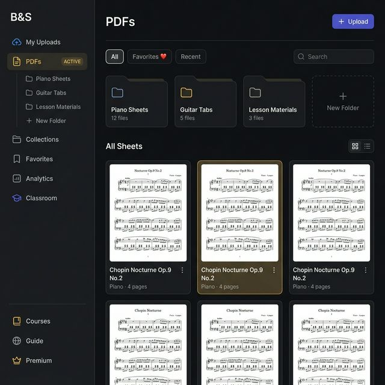
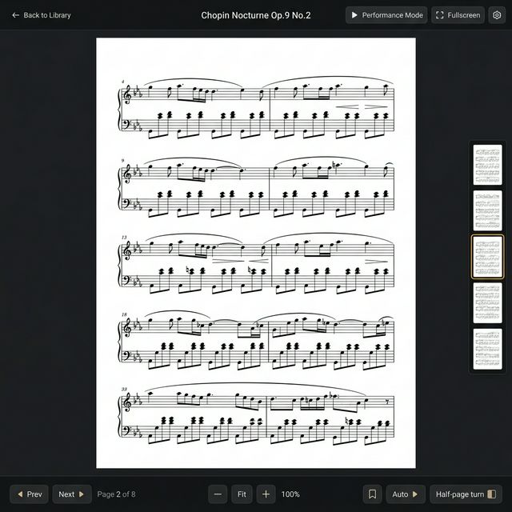

# PDF Feature — UI Mockups

> Thiết kế giao diện tham khảo cho tính năng PDFs. Xem thiết kế chi tiết tại [pdf_sheet_music_design.md](pdf_sheet_music_design.md).

---

## 1. Library Page (`/dashboard/pdfs`)

Sidebar có "PDFs" ngang hàng "My Uploads", expand ra folder tree. Content area hiện folders + PDF grid.

**Thành phần:**
- Header: title "PDFs" + nút "+ Upload"
- Filter pills: All, Favorites, Recent + Search bar
- Folder cards + "New Folder"
- PDF Grid/List toggle — thumbnail trang 1, title, instrument, page count, menu ⋮

---

## 2. Viewer Page (`/dashboard/pdfs/view/[id]`)

Tối giản để maximize không gian đọc sheet music. Tối ưu cho nhạc sĩ đang chơi nhạc.

**Thành phần:**
- Top bar mỏng: ← Back, title, Performance Mode, Fullscreen
- PDF chiếm toàn bộ trung tâm
- Quick-jump thumbnails bên phải
- Bottom toolbar: Page nav, Zoom, Bookmark, Auto-scroll, Half-page turn
