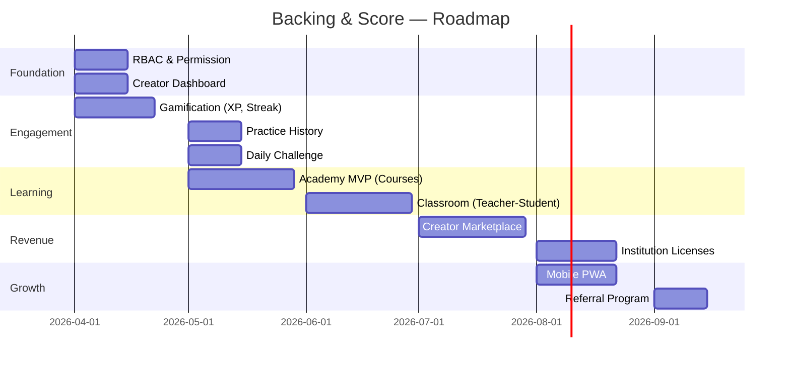

# Backing & Score — System Review & Strategy

## 1. Feature Inventory

### 🎵 Core Music Engine (100% Complete)
| Feature | Status | Key Files |
|---------|--------|-----------|
| Audio playback (multi-track) | ✅ | `AudioManager.ts`, [TrackList.tsx](file:///Users/jefftrung/projects/paperclip/lotusa/projects/backing-and-score/src/components/editor/TrackList.tsx) |
| MusicXML score rendering (Verovio) | ✅ | [MusicXMLVisualizer.tsx](file:///Users/jefftrung/projects/paperclip/lotusa/projects/backing-and-score/src/components/editor/MusicXMLVisualizer.tsx), `verovio/` |
| MIDI synth playback | ✅ | [MetronomeEngine.ts](file:///Users/jefftrung/projects/paperclip/lotusa/projects/backing-and-score/src/lib/audio/MetronomeEngine.ts), [useScoreEngine.ts](file:///Users/jefftrung/projects/paperclip/lotusa/projects/backing-and-score/src/hooks/useScoreEngine.ts) |
| Playhead with beat-level interpolation | ✅ | [MusicXMLVisualizer.tsx](file:///Users/jefftrung/projects/paperclip/lotusa/projects/backing-and-score/src/components/editor/MusicXMLVisualizer.tsx) |
| Metronome with beat-level scheduling | ✅ | [MetronomeEngine.ts](file:///Users/jefftrung/projects/paperclip/lotusa/projects/backing-and-score/src/lib/audio/MetronomeEngine.ts) |
| Transport bar (BPM, rate, time sig) | ✅ | [TransportBar.tsx](file:///Users/jefftrung/projects/paperclip/lotusa/projects/backing-and-score/src/components/editor/TransportBar.tsx) |
| Waveform visualization | ✅ | [Waveform.tsx](file:///Users/jefftrung/projects/paperclip/lotusa/projects/backing-and-score/src/components/editor/Waveform.tsx) |
| Piano Roll region display | ✅ | [PianoRollRegion.tsx](file:///Users/jefftrung/projects/paperclip/lotusa/projects/backing-and-score/src/components/editor/PianoRollRegion.tsx) |
| Timeline ruler | ✅ | [TimelineRuler.tsx](file:///Users/jefftrung/projects/paperclip/lotusa/projects/backing-and-score/src/components/editor/TimelineRuler.tsx) |

### 🥁 Sync System (100% Complete)
| Feature | Status | Key Files |
|---------|--------|-----------|
| 3-key tapping (Enter/Shift/←) | ✅ | [EditorShell.tsx](file:///Users/jefftrung/projects/paperclip/lotusa/projects/backing-and-score/src/components/editor/EditorShell.tsx) |
| `beatTimestamps` data model | ✅ | [types.ts](file:///Users/jefftrung/projects/paperclip/lotusa/projects/backing-and-score/src/lib/daw/types.ts) |
| Auto-fill missing beats on downbeat | ✅ | [EditorShell.tsx](file:///Users/jefftrung/projects/paperclip/lotusa/projects/backing-and-score/src/components/editor/EditorShell.tsx) |
| Mid-measure key with auto-fill | ✅ | [EditorShell.tsx](file:///Users/jefftrung/projects/paperclip/lotusa/projects/backing-and-score/src/components/editor/EditorShell.tsx) |
| Key configuration (Settings popup) | ✅ | [TransportBar.tsx](file:///Users/jefftrung/projects/paperclip/lotusa/projects/backing-and-score/src/components/editor/TransportBar.tsx) |
| Sync Mode HUD (live feedback) | ✅ | [SyncModeHUD.tsx](file:///Users/jefftrung/projects/paperclip/lotusa/projects/backing-and-score/src/components/editor/SyncModeHUD.tsx) |
| Measure Map Editor | ✅ | [MeasureMapEditor.tsx](file:///Users/jefftrung/projects/paperclip/lotusa/projects/backing-and-score/src/components/editor/MeasureMapEditor.tsx) |
| Beat Timeline Editor | ✅ | [BeatTimelineEditor.tsx](file:///Users/jefftrung/projects/paperclip/lotusa/projects/backing-and-score/src/components/editor/BeatTimelineEditor.tsx) |
| Tempo Map Track (visual) | ✅ | [TempoMapTrack.tsx](file:///Users/jefftrung/projects/paperclip/lotusa/projects/backing-and-score/src/components/editor/TempoMapTrack.tsx) |
| Elastic Grid toggle | ✅ | [TransportBar.tsx](file:///Users/jefftrung/projects/paperclip/lotusa/projects/backing-and-score/src/components/editor/TransportBar.tsx) |

### 🎼 Editor (DAW) (95% Complete)
| Feature | Status | Key Files |
|---------|--------|-----------|
| Multi-track editor shell | ✅ | [EditorShell.tsx](file:///Users/jefftrung/projects/paperclip/lotusa/projects/backing-and-score/src/components/editor/EditorShell.tsx) |
| Score upload (MusicXML) | ✅ | [EditorActionBar.tsx](file:///Users/jefftrung/projects/paperclip/lotusa/projects/backing-and-score/src/components/editor/EditorActionBar.tsx) |
| Audio track management | ✅ | [TrackList.tsx](file:///Users/jefftrung/projects/paperclip/lotusa/projects/backing-and-score/src/components/editor/TrackList.tsx) |
| Cover image upload | ✅ | [EditorActionBar.tsx](file:///Users/jefftrung/projects/paperclip/lotusa/projects/backing-and-score/src/components/editor/EditorActionBar.tsx) |
| Tags picker (wiki linking) | ✅ | [EditorTagsPicker.tsx](file:///Users/jefftrung/projects/paperclip/lotusa/projects/backing-and-score/src/components/editor/EditorTagsPicker.tsx) |
| Rich text editor (Tiptap) | ✅ | [TiptapEditor.tsx](file:///Users/jefftrung/projects/paperclip/lotusa/projects/backing-and-score/src/components/editor/TiptapEditor.tsx) |
| Project save/publish/unpublish | ✅ | [EditorActionBar.tsx](file:///Users/jefftrung/projects/paperclip/lotusa/projects/backing-and-score/src/components/editor/EditorActionBar.tsx) |
| Loop mode with tempo ramp | ✅ | [useScoreEngine.ts](file:///Users/jefftrung/projects/paperclip/lotusa/projects/backing-and-score/src/hooks/useScoreEngine.ts) |
| MIDI instrument overrides | ✅ | [TransportBar.tsx](file:///Users/jefftrung/projects/paperclip/lotusa/projects/backing-and-score/src/components/editor/TransportBar.tsx) |
| Per-track volume/mute/solo | ✅ | [TrackList.tsx](file:///Users/jefftrung/projects/paperclip/lotusa/projects/backing-and-score/src/components/editor/TrackList.tsx) |
| Gamification provider (skeleton) | ⏳ | [GamificationProvider.tsx](file:///Users/jefftrung/projects/paperclip/lotusa/projects/backing-and-score/src/components/editor/GamificationProvider.tsx) |

### 🎧 Player (End-User) (100% Complete)
| Feature | Status | Key Files |
|---------|--------|-----------|
| Play shell (full-page player) | ✅ | [PlayShell.tsx](file:///Users/jefftrung/projects/paperclip/lotusa/projects/backing-and-score/src/components/player/PlayShell.tsx) |
| Player controls (play/pause/seek) | ✅ | [PlayerControls.tsx](file:///Users/jefftrung/projects/paperclip/lotusa/projects/backing-and-score/src/components/player/PlayerControls.tsx) |
| Snippet player (preview/embed) | ✅ | [SnippetPlayer.tsx](file:///Users/jefftrung/projects/paperclip/lotusa/projects/backing-and-score/src/components/player/SnippetPlayer.tsx) |

### 📚 Wiki / Content CMS (100% Complete)
| Feature | Status | Key Files |
|---------|--------|-----------|
| Artists (list + detail pages) | ✅ | `wiki/artists/` |
| Compositions (list + detail pages) | ✅ | `wiki/compositions/` |
| Genres (list + detail pages) | ✅ | `wiki/genres/` |
| Instruments (list + detail pages) | ✅ | `wiki/instruments/` |
| Wiki search dialog | ✅ | [WikiSearchDialog.tsx](file:///Users/jefftrung/projects/paperclip/lotusa/projects/backing-and-score/src/components/WikiSearchDialog.tsx) |
| Wiki translations | ✅ | [wikiTranslations.ts](file:///Users/jefftrung/projects/paperclip/lotusa/projects/backing-and-score/src/lib/appwrite/wikiTranslations.ts) |
| Admin wiki management | ✅ | [admin/wiki/page.tsx](file:///Users/jefftrung/projects/paperclip/lotusa/projects/backing-and-score/src/app/%5Blocale%5D/admin/wiki/page.tsx) |
| Admin import (batch MusicXML) | ✅ | [admin/import/page.tsx](file:///Users/jefftrung/projects/paperclip/lotusa/projects/backing-and-score/src/app/%5Blocale%5D/admin/import/page.tsx) |
| Admin review/publish | ✅ | [admin/review/page.tsx](file:///Users/jefftrung/projects/paperclip/lotusa/projects/backing-and-score/src/app/%5Blocale%5D/admin/review/page.tsx) |
| AI enrichment (Gemini) | ✅ | [api/ai-enrich/route.ts](file:///Users/jefftrung/projects/paperclip/lotusa/projects/backing-and-score/src/app/api/ai-enrich/route.ts) |

### 💰 Payment & Subscription (90% Complete)
| Feature | Status | Key Files |
|---------|--------|-----------|
| LemonSqueezy checkout API | ✅ | [api/checkout/route.ts](file:///Users/jefftrung/projects/paperclip/lotusa/projects/backing-and-score/src/app/api/checkout/route.ts) |
| Subscription management | ✅ | [subscriptions.ts](file:///Users/jefftrung/projects/paperclip/lotusa/projects/backing-and-score/src/lib/appwrite/subscriptions.ts) |
| Pricing page | ✅ | [pricing/page.tsx](file:///Users/jefftrung/projects/paperclip/lotusa/projects/backing-and-score/src/app/%5Blocale%5D/pricing/page.tsx) |
| Upgrade prompt (gating) | ✅ | [UpgradePrompt.tsx](file:///Users/jefftrung/projects/paperclip/lotusa/projects/backing-and-score/src/components/UpgradePrompt.tsx) |
| Subscription card (dashboard) | ✅ | [SubscriptionCard.tsx](file:///Users/jefftrung/projects/paperclip/lotusa/projects/backing-and-score/src/components/SubscriptionCard.tsx) |
| Webhook handling | ⏳ | `webhooks/lemonsqueezy/` |

### 👤 User System
| Feature | Status | Key Files |
|---------|--------|-----------|
| Login / Sign up | ✅ | `login/`, `signup/` |
| Email verification | ✅ | [verify/page.tsx](file:///Users/jefftrung/projects/paperclip/lotusa/projects/backing-and-score/src/app/%5Blocale%5D/verify/page.tsx) |
| Dashboard | ✅ | [dashboard/page.tsx](file:///Users/jefftrung/projects/paperclip/lotusa/projects/backing-and-score/src/app/%5Blocale%5D/dashboard/page.tsx) |
| Favorites system | ✅ | [favorites.ts](file:///Users/jefftrung/projects/paperclip/lotusa/projects/backing-and-score/src/lib/appwrite/favorites.ts) |
| Social features (follow, etc.) | ✅ | [social.ts](file:///Users/jefftrung/projects/paperclip/lotusa/projects/backing-and-score/src/lib/appwrite/social.ts) |
| Playlists / Collections | ✅ | [playlists.ts](file:///Users/jefftrung/projects/paperclip/lotusa/projects/backing-and-score/src/lib/appwrite/playlists.ts) |

### 🌐 Platform
| Feature | Status | Key Files |
|---------|--------|-----------|
| i18n (9 languages) | ✅ | `messages/*.json` |
| SEO / Sitemap | ✅ | `sitemap.ts` |
| Dark mode | ✅ | [ThemeToggle.tsx](file:///Users/jefftrung/projects/paperclip/lotusa/projects/backing-and-score/src/components/ThemeToggle.tsx) |
| Discover page | ✅ | [discover/page.tsx](file:///Users/jefftrung/projects/paperclip/lotusa/projects/backing-and-score/src/app/%5Blocale%5D/discover/page.tsx) |
| Feed page | ✅ | [feed/page.tsx](file:///Users/jefftrung/projects/paperclip/lotusa/projects/backing-and-score/src/app/%5Blocale%5D/feed/page.tsx) |
| User Guide | ✅ | [user-guide/page.tsx](file:///Users/jefftrung/projects/paperclip/lotusa/projects/backing-and-score/src/app/%5Blocale%5D/user-guide/page.tsx) |
| Embed page | ✅ | [embed/page.tsx](file:///Users/jefftrung/projects/paperclip/lotusa/projects/backing-and-score/src/app/%5Blocale%5D/embed/page.tsx) |
| Search | ✅ | [s/page.tsx](file:///Users/jefftrung/projects/paperclip/lotusa/projects/backing-and-score/src/app/%5Blocale%5D/s/page.tsx) |
| Middleware (auth/i18n) | ✅ | [middleware.ts](file:///Users/jefftrung/projects/paperclip/lotusa/projects/backing-and-score/src/middleware.ts) |

### 📖 Academy / Learning (Skeleton)
| Feature | Status | Key Files |
|---------|--------|-----------|
| Academy page | ⏳ | [academy/page.tsx](file:///Users/jefftrung/projects/paperclip/lotusa/projects/backing-and-score/src/app/%5Blocale%5D/academy/page.tsx) |
| Courses service | ⏳ | [courses.ts](file:///Users/jefftrung/projects/paperclip/lotusa/projects/backing-and-score/src/lib/appwrite/courses.ts) |
| Lessons service | ⏳ | [lessons.ts](file:///Users/jefftrung/projects/paperclip/lotusa/projects/backing-and-score/src/lib/appwrite/lessons.ts) |

---

## 2. User Roles — Current vs. Ideal

| Role | Current Implementation | Cần Bổ Sung |
|------|----------------------|-------------|
| **Admin** | Admin pages exist (import, review, wiki). No formal role enforcement. | RBAC middleware, admin-only API protection |
| **Content Manager** | Not distinguished from Admin | Separate role with project-level permissions |
| **Creator** | Can create/edit/publish own projects | Creator dashboard, analytics, revenue sharing |
| **User** | Login, favorites, playlists, subscription gating | Practice history, achievements, learning progress |
| **Guest** | Can browse, play (with daily limits) | Clear upgrade prompts, registration incentives |

> [!IMPORTANT]
> Hiện tại hệ thống **chưa có RBAC (Role-Based Access Control)** ở tầng middleware. Các trang admin chỉ dựa vào client-side check. Đây là điều cần ưu tiên khi có nhiều người dùng.

---

## 3. Chưa Hoàn Thành / Cần Hoàn Thiện

### 🔴 Ưu Tiên Cao
1. **RBAC & Permission System**: Phân quyền chính thức cho Admin / Content Manager / Creator / User / Guest ở cả API và middleware
2. **Academy / Courses / Lessons**: Service layer ([courses.ts](file:///Users/jefftrung/projects/paperclip/lotusa/projects/backing-and-score/src/lib/appwrite/courses.ts), [lessons.ts](file:///Users/jefftrung/projects/paperclip/lotusa/projects/backing-and-score/src/lib/appwrite/lessons.ts)) đã có skeleton nhưng chưa có UI hoàn chỉnh
3. **Gamification**: File [GamificationProvider.tsx](file:///Users/jefftrung/projects/paperclip/lotusa/projects/backing-and-score/src/components/editor/GamificationProvider.tsx) chỉ là skeleton — chưa có XP, achievements, streak tracking
4. **Creator Dashboard**: Analytics (lượt play, lượt follow), quản lý revenue

### 🟡 Ưu Tiên Trung Bình
5. **Classroom / Live Learning**: Tương lai cho phép teacher tạo classroom, assign bài tập, theo dõi tiến trình học viên
6. **Social Enhancement**: Comment, rating, share — file [social.ts](file:///Users/jefftrung/projects/paperclip/lotusa/projects/backing-and-score/src/lib/appwrite/social.ts) đã có foundation
7. **Webhook Robustness**: LemonSqueezy webhook cần xử lý edge cases (retry, idempotency)
8. **Practice Mode Improvements**: Wait mode, slow-practice loop đã có — cần thêm practice history tracking

### 🟢 Nice to Have
9. **Mobile App**: PWA hoặc React Native wrapper
10. **Offline Mode**: Cache audio + score cho phép practice offline
11. **AI Features**: Auto-generate practice exercises, smart tempo suggestions
12. **Marketplace**: Cho phép Creator bán bài hát/course, hệ thống chia sẻ doanh thu

---

## 4. Chiến Lược Thu Hút & Gắn Kết User

### 🎯 Giai Đoạn 1: Thu Hút (Acquisition)

| Chiến lược | Chi tiết | Effort |
|-----------|---------|--------|
| **Freemium generosa** | Cho Guest/User play thoải mái 3-5 bài/ngày không cần đăng ký. Số lượng đủ để "nghiện" nhưng tạo FOMO muốn thêm | Low |
| **SEO-driven Wiki** | Wiki artist/composition/genre đã rất mạnh → tối ưu SEO để Google crawl. Mỗi trang wiki có embedded player snippet → chuyển đổi visitor → user | Low |
| **Embed Player** | Cho phép nhúng SnippetPlayer vào blog/forum/Facebook → viral loop. Đã có [embed/page.tsx](file:///Users/jefftrung/projects/paperclip/lotusa/projects/backing-and-score/src/app/%5Blocale%5D/embed/page.tsx) | Low |
| **Referral Program** | User mời bạn → cả 2 được thêm X ngày premium miễn phí | Medium |
| **Creator Onboarding** | Mời giáo viên nhạc upload bài → nội dung miễn phí cho học trò → network effect | Medium |

### 🎯 Giai Đoạn 2: Kích Hoạt (Activation)

| Chiến lược | Chi tiết | Effort |
|-----------|---------|--------|
| **Onboarding Flow** | Khi user mới đăng ký: chọn nhạc cụ → chọn trình độ → gợi ý 3 bài phù hợp → bắt đầu practice ngay | Medium |
| **Daily Challenge** | Mỗi ngày 1 đoạn nhạc ngắn (16 ô nhịp) → practice → nhận XP. Tạo thói quen quay lại | Medium |
| **Quick Win** | Bài tập đầu tiên PHẢI dễ → user cảm thấy "mình làm được!" → motivation tăng | Low |

### 🎯 Giai Đoạn 3: Gắn Kết (Retention)

| Chiến lược | Chi tiết | Effort |
|-----------|---------|--------|
| **Streak System** | Practice liên tục X ngày → badge/reward. Miss 1 ngày → mất streak. Áp lực tích cực | Medium |
| **XP & Levels** | Mỗi bài practice xong → XP. Level up → unlock features/badges | Medium |
| **Practice History** | "Tuần này bạn đã practice 45 phút, tăng 20% so với tuần trước" — data-driven motivation | Medium |
| **Collections / Playlists** | User tự tạo playlist practice → share → community curation | Low (đã có) |
| **Social Proof** | "12,345 người đã practice bài này" / "Top 10 bài được practice nhiều nhất" | Low |
| **Notifications** | Email/push nhẹ nhàng: "Bạn chưa practice 3 ngày rồi. Bài X đang chờ bạn!" | Medium |

### 🎯 Giai Đoạn 4: Doanh Thu (Revenue)

| Chiến lược | Chi tiết | Effort |
|-----------|---------|--------|
| **Subscription Tiers** | Free (3 plays/ngày) → Plus ($4.99/tháng, unlimited) → Pro ($9.99/tháng, + AI features, + offline) | Low (đã có cơ bản) |
| **Creator Revenue Share** | Creator upload premium content → user mua → chia 70/30. Thu hút nội dung chất lượng | High |
| **Course Sales** | Teacher tạo course có cấu trúc → bán one-time hoặc subscription | High |
| **Institution Licenses** | Bán gói cho trường nhạc/conservatory → bulk pricing | Medium |

### 🎯 Giai Đoạn 5: Lan Truyền (Viral)

| Chiến lược | Chi tiết | Effort |
|-----------|---------|--------|
| **Share Practice Results** | "Tôi vừa hoàn thành Moonlight Sonata ở 80% speed!" → share Facebook/Instagram | Low |
| **Leaderboards** | Top practice time / Top accuracy cho mỗi bài → competitive motivation | Medium |
| **Community Forum / Feed** | Đã có [feed/page.tsx](file:///Users/jefftrung/projects/paperclip/lotusa/projects/backing-and-score/src/app/%5Blocale%5D/feed/page.tsx) → enhance thành community nơi user share tips, progress | Medium |
| **Teacher → Student Funnel** | Teacher share classroom link → students phải đăng ký → organic growth | Medium |

---

## 5. Đề Xuất Roadmap Kỹ Thuật (6 tháng)

> [!TIP]
> **Quick wins** ngay bây giờ (không cần code nhiều):
> 1. Bật SEO meta tags cho tất cả Wiki pages (đã có cơ bản)
> 2. Thêm social share buttons vào Player
> 3. Thêm "Play count" badge vào Discover page
> 4. Gửi welcome email khi user đăng ký mới
