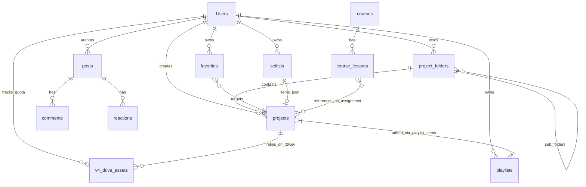

# KIẾN TRÚC CƠ SỞ DỮ LIỆU (DATABASE SCHEMA MAP)

Bản đồ này mô tả toàn bộ cấu trúc của các Collections trên Appwrite và mối quan hệ giữa chúng trong kiến trúc V4 (Universal Storage & Social Learning) của Backing & Score.

## 1. Bản Đồ Mối Quan Hệ (Entity Relationship)

---

## 2. Các Collection Liên Quan Trực Tiếp Đến My Drive (Quản lý File)

### A. `projects`
- **Mô tả:** Trái tim của hệ thống. Mỗi "bản nhạc", "nhịp trống", hay "file PDF" mà user nhìn thấy trên giao diện đều là 1 Project.
- **Dữ liệu hạt nhân (JSON Payload):** Cột `payload` chứa chuỗi JSON đại diện cho toàn bộ nội dung của project.
  - **Lưu ý về Navigation Map:** Navigation Map (Timemap, MeasureMap để chỉ định nhịp/khuông nhạc) KHÔNG phải là một collection riêng. Nó được nhúng trực tiếp vào thuộc tính `notationData.timemap` và `notationData.measureMap` bên trong chuỗi JSON `payload` này.
- **Mối ghép:**
  - `folderId` trỏ đến `project_folders`.
  - `payload.notationData.fileId` trỏ đến `r2Key` của file đặt trên Cloudflare.
  - `coverUrl` trỏ đến `r2Key` của ảnh bìa/Thumbnail.

### B. `v4_drive_assets`
- **Mô tả:** Sổ cái ghi nợ dung lượng (Quota Tracker).
- **Cách thức hoạt động:** Chỉ ghi nhận file thô (PDF, Audio, MusicXML) đã được ném lên rổ chứa R2 Bucket. Có trường `sizeBytes` để cộng dồn chặn đứng những tài khoản dùng quá 150MB miễn phí.
- **Quyền hạn đặc biệt (Permissions):** Cực kỳ cẩn thận với Collection này! Ở cấp độ Collection, Role `Users` bắt buộc phải được tick vào ô `Create`. Tuyệt đối không chọn `Read/Update/Delete` ở ngoài cùng để tránh rò rỉ dữ liệu.

### C. `project_folders`
- **Mô tả:** Hộp chứa các Projects. Hỗ trợ cha-con đệ quy (`parentFolderId`).
- **Luật xóa:** Khi xóa Folder, hàm máy chủ sẽ đệ quy xóa sạch các Subfolder và gọi hàm xóa luôn các project nằm trong đó.

### D. `playlists`
- **Mô tả:** Bộ sưu tập nhạc do user tự gom lại. Một Project có thể nằm ở nhiều Playlist.
- **Mối ghép:** Liên kết thông qua mảng m-n `projectIds` bên trong collection.

### E. `setlists`
- **Mô tả:** Danh sách bài biểu diễn. Giống Playlist nhưng thiên về mục đích diễn live.
- **Mối ghép:** Dữ liệu chi tiết các bài hát được lưu dưới dạng chuỗi JSON thô trong cột `items`: `[{ projectId: "..." }]`. Cần phải Parse JSON để xác định quan hệ với Project.

### F. `favorites`
- **Mô tả:** Danh sách thả tim/yêu thích của User.
- **Mối ghép:** Liên kết đa hình. Dùng cột `targetType` (vd: `"project"`) và `targetId` trỏ về `projects.$id`.

---

## 3. Hệ Thống Cũ (Legacy V3 - My PDFs) - Đang dần loại bỏ

Ở một số File cũ trong source code (như `/dashboard/pdfs/view/[id]`), bạn sẽ thấy chúng đi theo kiến trúc V3 cũ. Hệ thống này sử dụng các Collections hoàn toàn tách biệt:

### A. `sheet_music`
- **Mô tả:** Đóng vai trò tương tự như `projects` hiện hành, nhưng chỉ hỗ trợ thuần PDF vật lý, không có Audio hay MusicXML.

### B. `sheet_nav_maps`
- **Mô tả:** Thay vì gom chung gọn gàng vào cục JSON như V4, hệ thống cũ tách tính năng Điều hướng PDF ra thành một bảng riêng biệt lấy tên là `sheet_nav_maps`. Bảng này dính chặt với bảng `sheet_music` qua khóa ngoại `sheetMusicId`.
- **Dữ liệu:** Lưu tọa độ Bookmark (`yPercent`) và thứ tự cuộn trang (`sequence`). Việc tách bảng này ở thiết kế V3 đã cho thấy khuyết điểm rách nát dữ liệu nếu người dùng sao chép hoặc xóa PDF mà quên không xóa bảng Nav, vì vậy nó đã bị gộp lại vào JSON Payload ở phiên bản V4 hiện hành.

---

## 4. Quy Trình Clean-up Rác Tiêu Chuẩn

Mỗi khi phát triển tính năng Xóa một `Project`, hãy luôn rà soát đủ 4 bước sau để hệ thống không sinh ra Rác Ẩn (Phantom Data):

1. **Delete File/Thumbnail on Cloudflare R2:** Gọi S3 API xóa vật lý để đỡ tốn tiền thuê bao AWS/Cloudflare.
2. **Delete v4_drive_assets:** Xóa bản ghi kiểm kê dung lượng (Khôi phục Quota cho user).
3. **Delete Playlist, Setlist & Favorites Mappings:** 
   - Quét mảng `projectIds` trong các `playlists` và gỡ ID đã xóa.
   - Gỡ khỏi cục JSON `items` của `setlists`.
   - Xóa Document thả tim bên collection `favorites` nếu có.
4. **Delete Project Document:** Cuối cùng, xóa lệnh hiển thị vỏ bọc của Project khỏi giao diện.
