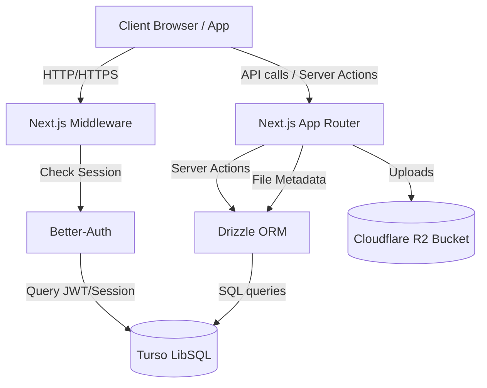
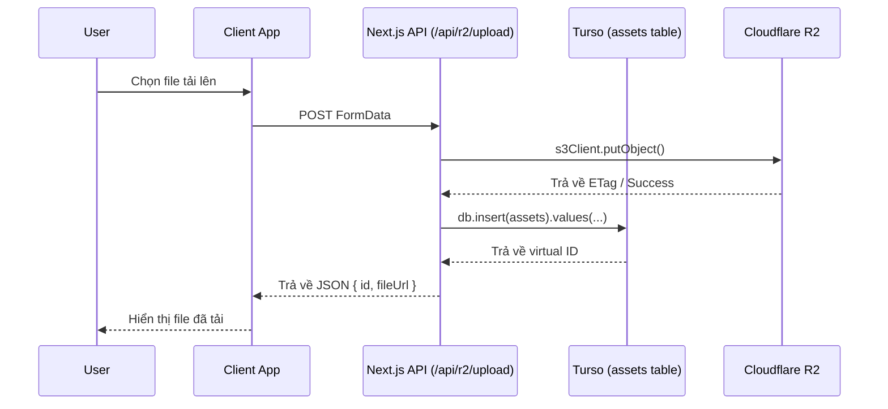

# 01. Infrastructure & Authentication (V5)

Tài liệu này mô tả chi tiết về tầng kiến trúc hạ tầng và xác thực trong phiên bản V5 của hệ thống. Đây là cốt lõi nền tảng mà mọi modules khác đều được xây dựng phía trên.

## Architecture Overview



## 1. Cơ sở dữ liệu: Turso (LibSQL) & Drizzle ORM

V5 đã loại bỏ hoàn toàn Appwrite (Backend-as-a-Service) và chuyển dịch sang kiến trúc **Next.js Server Actions + Edge SQL**.

- **Turso (LibSQL)**: Một giải pháp Database Serverless tương thích với SQLite, tối ưu cho xử lý Edge với tốc độ cực nhanh và hỗ trợ sync offline.
- **Drizzle ORM**: Thư viện ORM siêu nhẹ (Zero-dependencies), giúp chúng ta định nghĩa Schema của SQLite thành các bảng (tables) rõ ràng và Type-Safe hoàn toàn (TypeScript).

### Cấu trúc thư mục DB
- `src/db/schema/`: Nơi chứa toàn bộ định nghĩa các bảng của Database, được chia thành từng file theo Domain (VD: `auth.ts`, `social.ts`, v.v.).
- `src/db/index.ts`: Khởi tạo cổng kết nối duy nhất (Client) tới Turso qua `@libsql/client`.
- `drizzle.config.ts`: Cấu hình cho Drizzle-kit để nó biết phải đọc Schema từ đâu và push schema lên DB nào (Sử dụng Dialect là `turso`).

### Truy xuất Database từ Server Hành động (Server Actions)
Toàn bộ thao tác truy xuất DB được thực hiện ở Server Actions tại thư mục `src/app/actions/v5/`. 
*Quy chuẩn bắt buộc*: Không viết Logic chọc DB trực tiếp trên Client (Components).

Ví dụ:
```ts
import { getDb } from "@/db";
import { users } from "@/db/schema/auth";
import { eq } from "drizzle-orm";

export async function getUserProfile(userId: string) {
  const db = getDb();
  const rs = await db.select().from(users).where(eq(users.id, userId)).limit(1);
  return rs[0];
}
```

## 2. Hệ thống Xác thực: Better-Auth

V5 sử dụng **Better-Auth** làm hệ thống quản lý Identity và Session. Better-Auth kết nối trực tiếp với DB Turso của chúng ta để lưu thông tin Session và JWT.

### Cấu trúc Auth
- `src/lib/auth/better-auth.ts`: Khởi tạo Auth Client với Dialect SQLite, cắm Schema Drizzle vào. Nó thiết lập các tính năng xác thực cốt lõi.
- Trình quản lý Middleware của Next.js sẽ kiểm tra Session thông qua `betterAuth` thay vì Appwrite SDK cũ.

### Custom Fields (User Preferences)
Vì User Table mặc định của BetterAuth là cứng, chúng ta mở rộng Profile bằng một bảng phụ mang tên `user_prefs` (trong `src/db/schema/auth.ts`). 
- Bao gồm: `bio`, `birthday`, `gender`, `urls`.
- Tại các Server Action, ta thường phải join giữa bảng `user` và `user_prefs` thông qua `userId`. Tính năng `getPublicProfile()` trong thư mục actions xử lý việc gom nhóm này.

## 3. Storage & Object Delivery: Cloudflare R2

Để thay thế Appwrite Storage Bucket, hệ thống V5 sử dụng **Cloudflare R2** - Một dịch vụ lưu trữ Object S3-compatible không tính phí Egress băng thông ảo.

### Tích hợp
- `src/app/api/r2/upload/route.ts`: API nhận file Upload từ giao diện (Multipart form-data) thông qua `@aws-sdk/client-s3`.
- Bucket mặc định kết nối thông qua URL S3.
- Rất quan trọng: Những file tải lên là nhạc hoặc project XML có thể được bảo mật (dùng presigned URL) hoặc là Public cho phép truy cập. 
- Mọi bản ghi về File đều được đồng bộ hóa tên, định dạng, dung lượng vào file `src/db/schema/assets.ts`. Lớp này hoạt động như Virtual File System, trong khi File cứng (Raw) nằm trên R2.

### Sequence: Upload flow

