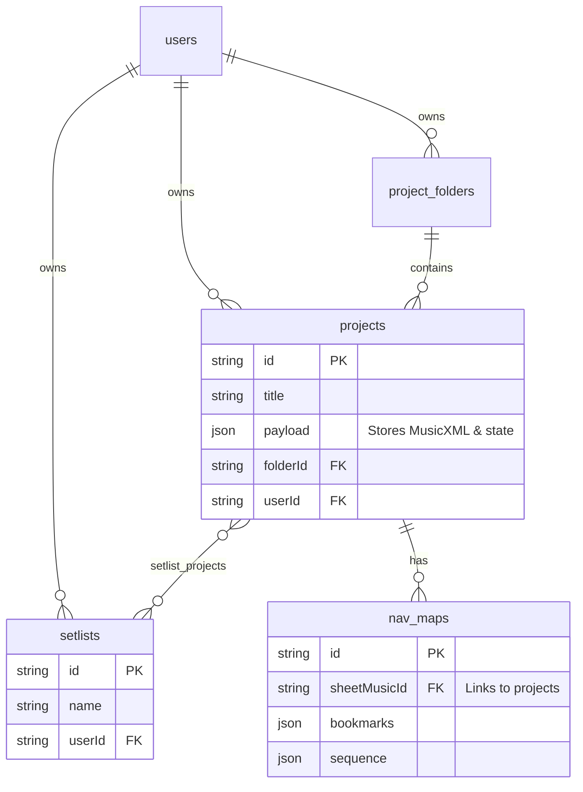

# 02. Drive & Digital Music Assets (V5)

Hệ thống cung cấp một module "Drive" lưu trữ cây thư mục đám mây cho các Tác phẩm cá nhân, File nhạc (MusicXML), và tài liệu (PDF). Đây là trái tim của không gian sáng tác ứng dụng.

## 1. Projects & Folders (Dự án & Thư mục)

Phiên bản V5 quản lý cây thư mục người dùng giống hệt Google Drive.
- `src/db/schema/drive.ts`: Định nghĩa bảng `projects` (Bài hát) và `project_folders` (Thư mục nhóm bài hát).
- Một Project có thể trực thuộc (via `folderId`) về một thư mục, hoặc là `null` (Bản gốc tại Root).
- Server Actions: `src/app/actions/v5/projects.ts` và `src/app/actions/v5/project-folders.ts`.
- **Payload Drizzle**: Do Drizzle hỗ trợ `{ mode: 'json' }` tốt, nên trường `payload` của Project được lưu như một Object JSON. Trong Code logic cũ của Appwrite, `payload` là chuỗi String hóa `"{}"`. Do vậy, lớp Actions V5 đã có function `mockAppwriteFormat` để dịch định dạng ngược lại thành String, giữ cho giao diện UI phía React vẫn tương thích mà không cần viết lại toàn bộ components.

## 2. Nav-Maps (Dấu Trang Từ Xa)

Trình Music Player PDF đôi lúc cần đồng bộ tín hiệu âm thanh với bản nhạc PDF trang ngang hoặc trang dọc, hoặc có những đoạn Coda/Dal Segno. Do đó hệ thống có tính năng Nav-maps (Bản đồ Dấu trang).
- `src/db/schema/drive.ts` (bảng `nav_maps`).
- NavMap bám vào `sheetMusicId` (trỏ ngược về thông tin File gốc).
- JSON objects cho `bookmarks` và `sequence` định nghĩa trình tự quét tọa độ điểm ảnh khi Play.

## 3. Playlists & Setlists (Tuyển tập biểu diễn)

User có thể tạo các tập hợp nhạc để biểu diễn liên tục (Setlist).
- `collections.ts` Schema phân tách giữa khái niệm Tập Nhạc Cơ Bản (Playlist) và Tập Biểu Diễn Nâng Cao (Setlist).
- Ở V5, Playlists sẽ có bảng phụ mang tên `playlist_projects` và `setlist_projects`. Sự kiện Add project vào Setlist thực chất là chèn 1 dòng (row inter-crossing) vào bảng phụ với yếu tố `order` để lưu thứ tự biểu diễn của bài hát trong cái Setlist đó.
- Server Actions: `src/app/actions/v5/setlists.ts` và `playlists.ts`. 

Tính năng sao chép Setlist sang tài khoản khác (`copySetlistToMine`) đòi hỏi chạy truy vấn theo chu trình Transaction hoặc đệ quy qua các bài hát (Projects) con bên trong nó.

### Entity-Relationship Diagram (ERD)

