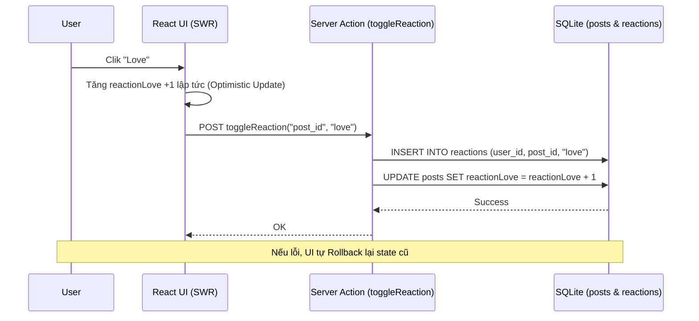
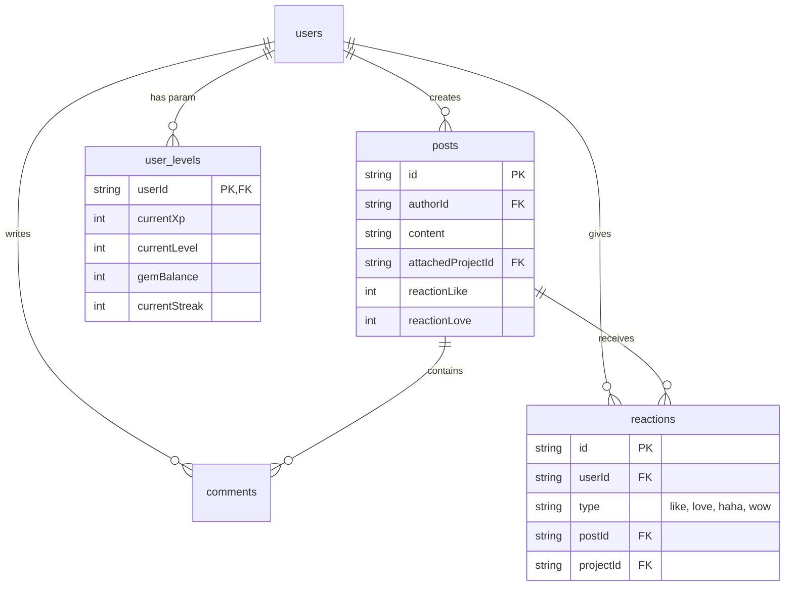

# 03. Social Feed & Gamification (V5)

Hệ thống cung cấp Mạng Xã Hội thu nhỏ và cơ chế học tập ứng dụng Gamification. 

## 1. Timeline Feed (Bảng Tin)

Tất cả các bài đăng của User sẽ hiện trên mục Timeline. Khi user nhấn chia sẻ Project hoặc Setlist/Playlist, một Post sẽ được tạo ra.
- `src/db/schema/social.ts`: Các Schema bao gồm `posts`, `comments`, `reactions`, `shares`, và `notifications`.
- Các Posts có loại đính kèm (Attachment). Ở SQLite, việc thiết kế "Đa hình" (Polymorphic) được giải quyết bằng các Cột Xuyên Tâm (Exclusive Arcs), nghĩa là bảng `posts` có cột `attachedProjectId`, `attachedSetlistId`. Giữa chúng chỉ có 1 cột được khác NULL.

## 2. Reactions (Tương tác thả cảm xúc)

Tương tự như Facebook, người dùng có thể Like, Love, Haha, Wow.
- V5 tự động tổng hợp đếm số Reaction bằng các cột **Denormalized** (như `reactionLike`, `reactionLove`, `reactionTotal`) trực tiếp trên bảng `posts` để việc truy vấn nhanh chóng mà không cần `.count()`.
- Server Actions `toggleReaction` trong `src/app/actions/v5/social.ts` quản lý việc tăng/giảm đồng thời (Optimistic UI support) các counter này trong DB thông qua cơ chế `INSERT` ... `ON CONFLICT` (tương hỗ Upsert nếu LibSQL cập nhật hoặc update thủ công nếu không).

### Sequence: Optimistic Reaction Update

## 3. Notifications (Thông báo)

Nhận dạng người dùng bị tương tác:
- Cột `actorId` chính là `sourceUserId` của API cũ. Nó đóng vai trò xác định kẻ gây ra thông báo.
- Cột `targetType` sẽ rẽ nhánh bằng cách dựa vào `postId` hoặc `projectId` của bản ghi đó.
- Lắng nghe: Client định kỳ gọi `listMyNotifications` thông qua SWR hoặc query actions.

## 4. Gamification (Hệ thống Xếp Hạng Trò Chơi)

Khuyến khích học thuật qua điểm thưởng (XP / GEM).
- `src/db/schema/gamification.ts`: Chứa session đăng nhập mỗi ngày (`daily_sessions`), chuỗi `streaks`.
- **Leveling**: Có quy chuẩn thăng cấp hạng thông qua số kinh nghiệm tích lũy (Exp) và hiển thị Rank (Tier) huy hiệu trên Profile công khai.
- Logic tại `src/app/actions/v5/gamification.ts`.

### Entity-Relationship Diagram (ERD)

