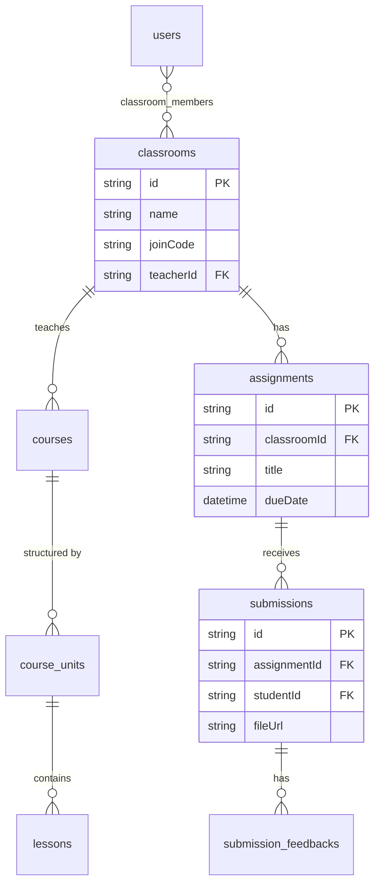

# 04. LMS & Classrooms (V5)

Module giáo dục của ứng dụng (LMS - Learning Management System) hỗ trợ giáo viên tạo lớp học và giao bài tập.

## 1. Classrooms (Lớp học trực tuyến)

Cấu trúc Entity-Relationship:
- `classrooms`: Chứa thông tin lớp học, mã code tham gia. Giáo viên đứng lớp sẽ có ID tương ứng.
- Phân quyền: Học viên muốn join phải nhập `joinCode`. Khi Join thành công sẽ sinh ra bản ghi trong `classroom_members`.
- `posts` của lớp học (bảng `posts` có cột `classroomId`). Đảm bảo bảng tin trong Lớp học là độc lập (Isolated) và không bị Public ra ngoài Timeline chính. Báo hiệu ranh giới giữa Social chung và Private Classroom.

## 2. Courses & Lessons (Chương trình Khóa Học)

- Lớp học có thể đính kèm một `Course`. Courses chứa các `course_units` (Chương) và `lessons` (Bài học).
- Giáo viên đăng tải các giáo trình bằng text, dạng video (link URL qua bảng `assets`), tài liệu âm thanh vào Lesson.

## 3. Assignments & Submissions (Bài tập & Nộp bài)

- `assignments` là giao kèo yêu cầu học viên nộp sản phẩm MusicXML (hoặc Audio).
- Bảng `submissions` lưu trữ file nộp của học viên, ràng buộc (foreign key) về `assignmentId` và `studentId`.
- **Review System (Feedback)**: Giáo viên truy cập `src/app/actions/v5/submission-feedback.ts` để ghim chú thích trên file PDF/MusicXML bằng tọa độ, và trả về Grading điểm. Toàn bộ feedback được lưu trên bảng `submission_feedbacks` dạng JSON array (vẫn là Drizzle type JSON).

### Entity-Relationship Diagram (ERD)

