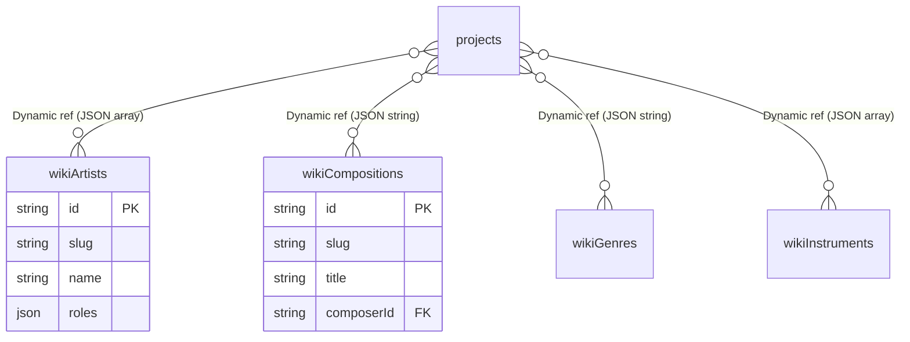

# 05. Wikipedia & Knowledge Catalogue (V5)

Bên cạnh nhạc cá nhân, toàn bộ nền nhạc của MusicXML đều thường được mix lại (Cover) từ các Tác giả và Tác phẩm thực tế ở ngoài đời. V5 xây dựng một Ontology Engine (Sơ đồ tri thức).

## 1. Thành phần Knowledge Base

Nằm ở `src/db/schema/wiki.ts` và quản lý qua `src/app/actions/v5` (tương ứng file name `artists.ts`, `compositions.ts`...):
- **Nghệ sĩ, Nhạc sĩ (wikiArtists)**: Lưu tiểu sử, ngày sinh, ngày mất, trường phái sáng tác.
- **Tác phẩm (wikiCompositions)**: Khúc nhạc gốc.
- **Thế loại (wikiGenres)**: Jazz, Pop, Rock, Classical...
- **Nhạc cụ (wikiInstruments)**: Piano, Organ, Guitar...

## 2. Relational Hooks (Móc xích thông tin)

Mỗi file `Project` sinh ra (Drive) đều có thể được User gắn thẻ (tags) gán cho các Entities thuộc Wiki.
- Trải nghiệm khám phá (Discovery): Ở trang Discover của ứng dụng, khi ấn vào một "Artist", hệ thống tự động filter toàn bộ các Projects tham chiếu tới `wikiComposerIds = [artist_id]`.
- Mối liên hệ Schema hoàn toàn động và không dùng Foreign Key cứng cho mảng JSON `wikiComposerIds`, giúp người dùng gỡ/gắn nhãn động mà không lo constraint khóa.

### Entity-Relationship Diagram (ERD)

## 3. SEO & Tối ưu hóa truy vấn Wiki

- Hệ thống cung cấp URL theo Friendly-Slug (VD: `/wiki/artists/ludwig-van-beethoven`) thay vì UUID.
- Server-side rendering của Next.js sẽ nạp `getArtistBySlugV5` để inject Metadata trả về cho các cỗ máy tìm kiếm.
