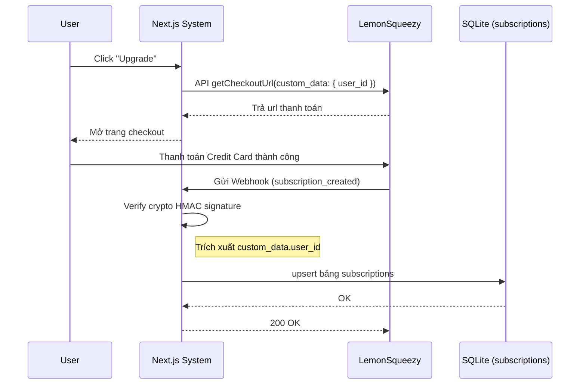

# 06. Monetization & Subscriptions (V5)

Module cuối cùng trong V5 quản lý cấp độ thành viên thông qua cổng thanh toán (LemonSqueezy) để mở khóa các đặc quyền nâng cao (Premium).

## 1. Cơ sở dữ liệu và Giới hạn (Limits)

Chúng ta có bảng `subscriptions` tại `src/db/schema/monetization.ts` để lưu lại gói mà người dùng đang đăng ký.
- Server action chủ chốt: `src/app/actions/v5/subscriptions.ts`. Nó kiểm tra tình trạng active của gói thông qua cột `status` và `renewsAt`.
- Nếu có subcription, User được set cờ `isPremium = true`.
- Tại các Action phân quyền, ví dụ tải file PDF chất lượng cao, tính năng sẽ chặn truy cập (Throws Error) nếu gọi API mà User không mang cờ Premium.

## 2. LemonSqueezy Webhooks Pipeline

Vì ứng dụng không thao tác cắm thẻ Credit Card nội bộ (PCI Compliance), toàn bộ billing diễn ra trên trang Checkout của Lemon. Khi thanh toán xong, Lemon gửi Webhook gọi ngược về app.
- Endpoint xử lý: `src/app/api/webhooks/lemonsqueezy/route.ts`.
- Luồng bảo mật: API kiểm tra HMAC SHA-256 signature tạo từ Secret của LemonSqueezy và Body.
- Event Types: 
  - `subscription_created`: Khi mua lần đầu, tạo bản ghi trên SQLite (`monetization.ts`).
  - `subscription_updated`: Khi Lemon thay đổi trạng thái (Thanh toán hàng tháng thành công hoặc Hết hạn thẻ), Update vào SQLite.
  - `subscription_cancelled`: Thu hồi cờ Premium.

## 3. Checkout Link Generator

- Nút "Upgrade to Premium" trên Giao diện gọi hàm server `getCheckoutUrl()`. 
- Hàm này nhồi `custom_data.user_id` trùng khớp với `userId` hiện tại của Better-Auth. Khi Webhook từ LemonSqueezy bắn về, Drizzle ORM sẽ dựa vào `customData.user_id` để INSERT/UPDATE đúng User chứ không dựa vào Email. Đảm bảo tính chống gian lận gỡ liên kết.

### Sequence: Subscription Pipeline

