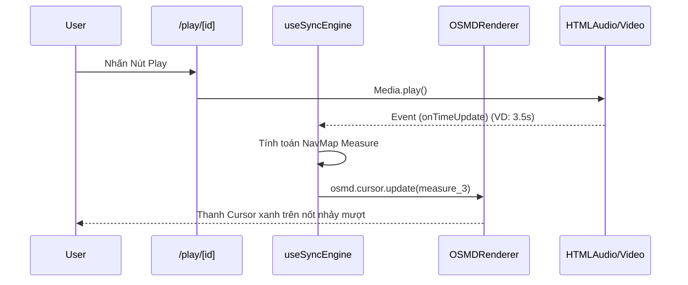

# E2E Workflows: 20. Player & Editor Pages

Tài liệu này đặc tả luồng luân chuyển dữ liệu và kiến trúc Page (App Router) cho 2 chức năng lõi: Soạn thảo (Studio) và Biểu diễn (Playback).

## 1. Flow: `/p/[projectId]` - Chế độ Soạn thảo (Studio Editing)

Trang này thiết kế để User tự load Editor soạn nhạc thuần túy, chỉnh sửa thuộc tính dự án.

### Server Component (`page.tsx`)
1. Nhận `params.projectId`.
2. Gọi hàm `getProjectV5(projectId)`. Phân quyền: Cắm hàm Auth kiểm tra User có quyền ghi/chỉnh sửa dự án này không (Dự án của tôi hoặc dự án được share cấp quyền Write).
3. Truyền dữ liệu tĩnh Project (dạng JSON parsed) và Sheet Music Content (Load từ R2 nếu có link, hoặc Load từ Payload cục bộ nếu nhỏ gọn) đổ xuống Client Component `<EditorShell />`.

### Logic Client (`EditorShell.tsx`)
- Quản lý trạng thái (State Management): Toàn bộ trạng thái Editor và Playback Engine không được đặt trực tiếp ở Page mà được bóc tách vào một cục Hook trung tâm là `useScoreEngine.ts`.
- Autosave: Khi `payload` (Dữ liệu gốc JSON của DAW) thay đổi thông qua hàm `onPayloadChange`, hệ thống sẽ set state ở `page.tsx` và có nút nhấn Save hoặc autosave theo từng thao tác sửa đổi.
- Thao tác: Giữ nhịp độ âm nhạc Playback thông qua `useScoreEngine` (cùng chung lõi với `TransportBar`).
- Xử lý Event Thoát: Chặn (BeforeUnloadEvent) nếu có thay đổi chưa sync lên Server.

---

## 2. Flow: `/play/[projectId]` - Chế độ Biểu diễn (Playback)

Đây là giao diện được rút gọn tối đa toàn bộ Sidebars, tập trung 100% vào màn hình hiển thị Score (OSMD) đồng bộ cùng dải âm thanh.

### Data Fetching (Server)
Đảm bảo tốc độ nhanh nhất (SSR Render ban đầu Loading UI). Load cả 2 mảng: Config Nav-Maps (Dấu trang tua nhạc) và file `.xml` thô để nhét vào cọc Initial State.

### Flow đồng bộ hóa (Backing Track Video/Audio Sync)
Vấn đề hóc búa nhất của Workflow này là đồng bộ tọa độ quét của MusicXML (Visual Cursor) với một đoạn file Video MP4 hoặc Audio MP3 thu sẵn.

#### Sơ đồ E2E Test (Hoạt động Client)

#### E2E Testing Scenarios (Sử dụng Cypress/Playwright)
- [x] **Trượt màn hình tự động**: Khi con trỏ `cursor` chạy đến mép dưới màn hình, Mock tọa độ và test sự kiện `window.scrollTo()` xem trình duyệt có tự đẩy trang PDF/XML xuống hay không.
- [x] **Sync Tolerance**: Tinh chỉnh slider âm thanh tua (Seek) tới giây 60, Expect hàm `useSyncEngine` tính lại Cursor Position khớp hoàn toàn và Highlight nốt tương ứng. Đảm bảo Seek Event không làm Crash con trỏ.
